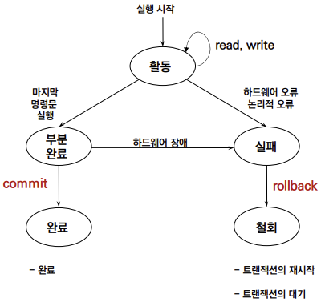
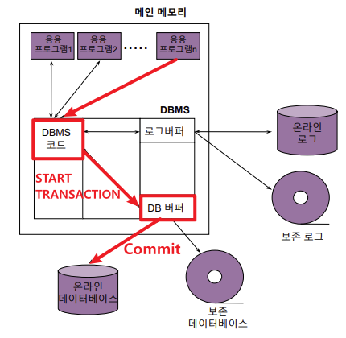
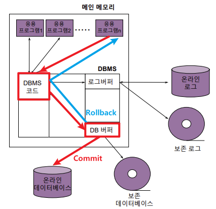
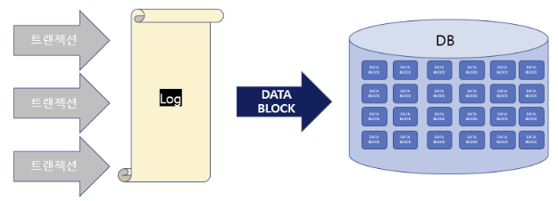

DB를 실제 사용함에 있어 가장 중요한 부분은 하나의 DataBase를 다수의 사용자가 "동시에" 공유해야 한다는 것이다.<br>

예를들어, 계좌이체나 좌석예약 같은 작업들을 생각해보면, 서로의 작업이 서로에게 영향을 미칠 수 있다는 것을 알 수 있다.<br>
따라서 이를 어떻게 제어하는지가 중요하다.

이를 "더이상 분할이 불가능한 업무처리의 단위", 즉 Transaction이라고 하는데,<br>
DataBase의 Transaction시에 반드시 갖춰야 할 주요 성질은 다음과 같다.

> **ACID**<br>
>
> - **Atomicity**(*원자성*)<br>
>   : Transaction과 관련된 작업들이 실행되다가 중단되지 않음을 보장
> - **Consistency**(*일관성*)<br>
>   : Transaction이 이전과 이후의 DataBase의 상태는 모두 DataBase의 제약이나 Rule을 만족함을 보장
> - **Isolation**(*격리성*)<br>
>   : Transaction시 다른 Transaction의 연산 작업이 끼어들지 못함을 보장
> - **Durability**(*영속성*)<br>
>   : 반영(Commit)이 완료된 Transaction의 내용은 영원히 적용됨

---
## 1. Commit & Rollback



<u>Database에는 **Atomicity**, **Consistency**, **Durability**를 보장하기 위한 Commit과 Rollback기능이 존재한다.</u>

### 1) Commit



> 변경내용이 영구적으로 Database에 반영되도록 하는 기능을 의미한다.
>
> Insert나 Delete, Update와 같은 SQL 문장을 여러 번 수행할 때,<br>
> DataBase는 우선 그 결과를 내부적으로 버퍼에 저장하고, 하나의 SQL문장이 끝날 때마다 이 결과를 Commit해 영구적으로 DataBase에 반영하게 된다.
>
>> 즉, <u>Commit을 활용하면 **논리적인 연산 단위를 재정의** 할 수 있는데</u>,<br>
>> 이는 계좌이체나, 좌석예약과 같은 시스템을 구축할 때 반드시 필요하다.
>
> ---
> #### MySQL
> 
> MySQL에는 Autocommit이라는 기능이 있는데, 이로인해 우리가 어떤 명령어를 입력하든 자동으로 Commit이 수행되게 된다.
>
> 따라서 Transaction을 위해서는 이 autocommit 기능을 꺼주고 Transaction기능을 켜야한다.
>
> - **Transaction tools**
>   - `START TRANSACTION;`<br>
>   : `COMMIT`, `ROLLBACK`이 나올 때까지 실행되는 모든 SQL추적
>
>   - `COMMIT`<br>
>   : `START TRANSACTION`이후부터 현재까지의 모든 코드 실행결과를 DB에 반영
>
>   - `ROLLBACK`<br>
>   : `START TRANSACTION`실행 전 상태로 DB의 상태를 되돌림 
>
> ---
> ex. 계좌이체 Procedure
> ```sql
> SET autocommit=0;
> START TRANSACTION;
>   UPDATE account
>   SET money = money+ 1000000$;
>   WHERE Name="UI-JIN";
>
>   UPDATE account
>   SET money = money- 1000000$;
>   WHERE Name="JU-YUNG";
> COMMIT;
> ```

### 2) Rollback



> 바로 이전에 Commit이 일어났던 상태로 Database의 버퍼 상태를 복구하는 것을 의미한다.
>
>> 한번 Commit이 한번 되면 그 이전상태로는 Rollback이 불가능하기 때문에<br>
>> 적절한 위치에서 Commit을 하는 것이 중요하다.
>
> 이는 뒤의 Undo작업과 같다.
> 
> *(참고)*
> *이때 DDL문은 Rollback대상이 되지 않는다는 점을 유의해야 한다.*

## 2. Redo & Undo

.png)

데이터베이스가 실행 도중 장애로 인해 손상되었다면 이를 복구하는 방법 또한 필요하다.

- 장애유형
  - Transaction defect(논리오류 및 데이터 불량)
  - System Defect(하드웨어 오동작)
  - Media Defect(디스크 고장)


### 1) LogData



> 위와 같이 결함으로 인해 데이터베이스가 손상되었을 경우 이를 복구하기 위해서는 Log Data가 반드시 필요하다.
>
> ---
> **WAL(Write-Ahead Logging) 이론**
>
> DB는 Commit이 발생하면 바로 DataBase 서버에 변경 사항을 바로 반영하지 않는다.
> 
> DB는 Sequential한 Log에 이러한 변경 사항을 적어 DB버퍼에 보관하다가 어느정도 데이터가 차게되면 Block으로 만들어 하드디스크에 Write하게 된다.
>
> 이로인해 얻을 수 있는 이점은 다음과 같다.
> - IO가 자주 발생하지 않기 때문에 DB의 성능을 올릴 수 있다.
> - Log에 먼저 적기 때문에 누가 조회를 하더라도 같은 Data를 보여줄 수 있다. (**Consistency**)
> - 서버가 다운되더라도 이미 Log에 먼저 기입하였기 때문에 원자성이 보장된다. (**Atomicity**)
>
> ---
> **Log 종류**
> 
> - Error Log
> - General Log
> - Binary Log 
> - Slow Query Log
> - ...
>
> *(참고: MySQL의 경우 my.ini파일을 통해 로그 설정을 할 수 있다.)*

### 2) Redo & Undo

.png)

> #### 즉시 갱신 회복
> #### 자연 갱신 회복

## 3. Concurency Control
**Isolation**

> #### Concurency Control
> #### Locking

최대한 병행성 확보가 중요()
serial schedule은 지양