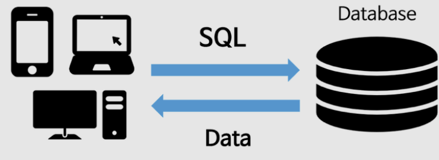
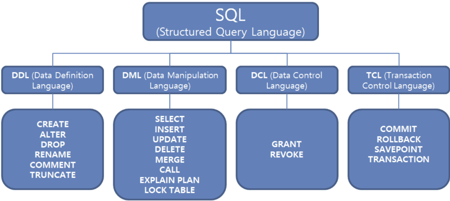
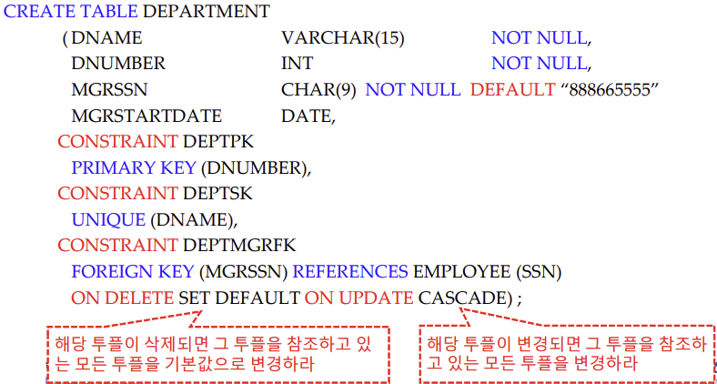
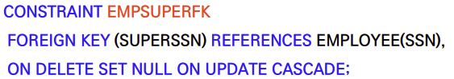
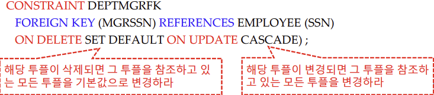
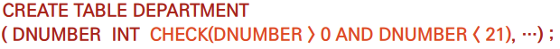
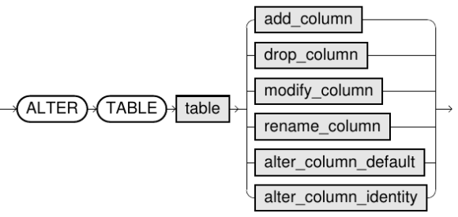

# SQL

앞서 데이터에 대한 이론적인 조작 방법인 Relational Algebra를 살펴 보았다.
SQL(Structured Query Language)은 이 Relational Algebra를 활용해 실제 Data Base를 다루기 위해 개발된 언어이다.

Relational Algebra는 데이터(Table)를 "어떻게" 다뤄야 할지에 초점을 맞췄었다면, SQL은 이를 바탕으로 DB에게 데이터(Table)을 "이렇게" 다뤄달라고 선언(정의)하는 언어라고 할 수 있다.

_( Reational Algebra : Functional Language )<br>
( SQL : Declaritive Language )_


즉, SQL은 수행 순서에 관한 것이 전혀 없다는 것을 인지하면서 공부하자.



>### 자료형
> Relational Algebra에서 우리가 Attribute를 만들기 위해 Domain이 필요했던 것이 기억나는가?
> 
> 데이터(Table)을 정의하기에 앞서 이 Domain을 표현하기 위한 대한 약속, 즉 데이터의 자료형을 어떻게 표현할 것인지 알아보고 가자.
>
> - **`char(n)`**
>   - n자리 문자열
>   - 길이가 고정되어 있기 때문에 주로 문자의 길이가 변하지 않는 데이터를 정의할 때 사용한다.
>
>
> - **`varchar(n)`**
>   - Compact함을 유지하는 n자리 문자열
>   - 데이터의 크기에 따라 저장공간의 크기가 변하기 때문에 주로 문자의 길이가 정해지지 않아야 할 때 사용한다.
>
> 이 외에도 다음과 같은 다양한 자료형이 존재한다.<br>
> (DB마다 다름)
> - **`int`** :정수
> - **`smallint`** :작은 정수
> - **`numeric(p,d)`** :소수점아래 d자리를 갖는 p자리 숫자열
> - **`float(n)`** :부동 소수점을 사용하는 수 데이터
> - **`real`** :float(24)
> - **`double precision`** :float(53)
> - ...

--- 
# SQL의 종류



## 1. DDL(Data Definition Language)

Table 전체의 골격을 정의할 때 사용하는 문장이다.
즉, Table 자체를 대상으로 하는 언어라고 생각하면 된다.

### 1) CREATE
Relation, 즉 table을 만드는 명령어는 다음과 같다.



> **Table 생성**
>
> ```sql
> CREATE TABLE 이름 (
>     A1    D1 {CONSTRAINT:option},
>     A2    D2 DEFAULT {value},
>     A3    D3,
>     {CONSTRAINT},
>     {CONSTRAINT}
> );
> ```
>
> 1. `A`: 생성할 Attribute의 이름
> 2. `D`: Attribute의 Domain, 즉 자료형
> 3. `{CONSTRAINT}`: Attribute의 제약조건 명시
> 4. `DEFAULT {value}`: DEFAULT로 들어갈 값을 명시
> 
> ---
> **Constraint- 종류**
>
> \- `PRIMARY KEY( {A} )` <br>
> \- `FOREIGN KEY( {A} ) REFERENCE R( {B} )`<br>
> \- `NOT NULL ( {A})`<br>
> \- `UNIQUE ( {A} )`<br>
>
>
> 1. `PRIMARY KEY`는 반드시 설정해 주어야 한다.<u>(Entity integrity)</u><br>
>   *(나머지 constraint는 반드시 사용해야 하는것은 아니다.)*<br>
>       - Primary Key = `UNIQUE` + `NOT NULL`
>
> 2. `FOREIGN KEY`설정 시 순서를 잘 지켜야 한다.<br>
>   *(자식 Table이 부모 Table보다 먼저 선언되어서는 안된다.)*
>       - `CREATE`와 동시에 `FOREIGN KEY` 선언: 권장하지 않음
>       - `CREATE`후 Table에 값을 채우고 `FOREIGN KEY`로 바꿈: 권장
>
> 3. `FOREIGN KEY`를 제외한 모든 Constraint는 Attribute와 같이 쓰는 것도 가능하다.<br>
>       - `Ssn  INT PRIMARY KEY,`: Ssn을 바로 Primary Key로 지정
>       - `PRIMARY KEY(Ssn),`: CREATE마지막에 따로 Primary Key로 지정 
> 
> ---
> **별명**
>
> 
> 
> `CONSTRAINT {별명}`사전에 명시하여 Constraint에 대한 이름을 만들 수 있다.
>
> ---
> **FOREIGNKEY + CASCADE**
>
> 
> 
> 어떤 Attribute에 대해 Delete나 Update가 실행됐을 때, 해당 Attribute를 참조하는 모든 Attribute에 대해 수행할 내용을 명시할 수 있다.
>
> ---
> **CHECK**
>
> 
>
> 어떤 Attribute의 Domain에 대해 Constraint를 부여하고 싶은 경우 `CHECK`를 사용하면 된다.


### 2) ALTER
Relation에서 Column(Attribute)에 대한 수정을 실행하는 명령어이다.



> Column추가, Column삭제, Column이름변경, Constraint 생성, ... 
> 
> alter table add constraint
> 
> ---
> **Attribute 추가**
>
> 
>
> ```sql
> ALTER TABLE R ADD A D;
> ALTER TABLE R ADD CONSTRAINT {constraint};
> ```
>
> 1. `R`: Attribute를 생성할 Table 이름
>
> 2. `A`: 생성할 Attribute 이름
>
> 3. `D`: 생성할 Attribute의 자료형(Domain), Constraint<br>
>   (`ALTER TABLE R ADD CONSTRAINT FOREIGN KEY(A) REFERENCE R(B)`)
>
> *(참고: Attribute를 추가한 후에는 우선 instance에는 null값으로 채워짐)*
>
> ---
> **Attribute 삭제**
>
> 
>
> ```sql
> ALTER TABLE R DROP A;
> ```
> 1. `R`: Attribute를 삭제할 Table 이름
>
> 2. `A`: 삭제할 Attribute 이름
>
> *(참고: 여러 Table과 얽혀 있는 Attribute를 삭제하는 것은 워낙 까다롭기 때문에 실제 DB에서는 이 기능을 지원하지 않을 가능성이 높다.)*
>
> ---
> **ALTER + CASCADE**
>
> CASCADE문도 사용 가능하다.
>
> ---
> **ALTER + RESTRICT**
>
> 변경되는 Attribute를 참조하는 Relation이나 View, Constraint가 없을 경우 `ALTER`를 수행

### 3) Drop


> **Table 삭제**
> 
> ```sql
> DROP TABLE R;
> ```
> 
> 1. `R`: 삭제할 table 이름
>
> ---
> **CASCADE, RESTRICT**
> 
> 두 옵션 모두 사용 가능하다.


---
## 2. DML(Data Manipulation Language)
DDL이 테이블을 대상으로 하는 문장이었다면 DML은 테이블안의 데이터를 다룰 때 사용하는 문장이다.<br>
즉, 데이터베이스에 들어 있는 데이터를 조회하거나 변형(삽입, 수정, 삭제)할 때 사용한다.


이 DML에는 다음과 같은 명령이 존재한다.

### 1) SELECT - FROM - WHERE
데이터(Table)를 조회하고 가져오는 방법이다.


이렇게 가져온 데이터들은 Table로 재구성되어 있다. (즉, select의 결과는 Table이다.)

> ```sql
> SELECT A
> FROM R
> WHERE C;
> ```
> *(자세한 내용은 SQL Basic(2)에서 다뤄보자.)*
>
> ---
> **FROM**
>
> 먼저 조회에 활용하고자 하는 Table을 가져온다. <br>
> 가져오는 방법에는 다음과 같은 방법이 있다.
>
> 1. ```sql
>    FROM R1, R2 
>    -- Catesian Product: R1과 R2의 모든 조합을 구하는 것
>    ```  
>
>
> 2. ```sql
>    FROM R1 JOIN R2 ON (R1.id=R2.ID) 
>    -- Join: R1과 R2의 조합 중 특정 조건을 만족하는 조합을 구하는 것
>    ```
> 
> 이때, Join하는 방식에는 다양한 방법이 존재하기 때문에 이는 추후 다시 설명할 예정이다.
> 
> ---
> **WHERE**
> 
> `Relation`안에서 `Condition`을 만족하는 Row만을 고르기 위해 사용한다.<br>
> 사용하지 않을경우 From에서 선택한 모든 데이터를 가져온다.
> 
> ```sql
> FROM R1, R2
> WHERE R1.salary > R2.salary
> -- Relational Algebra의 select와 같은 역할을 수행한다.
> ```
> WHERE절에도 `EXIST`, `IN` 등등 다양한 수식을 사용할 수 있는데 이는 추후 다시 설명할 예정이다.
>
> ---
> **SELECT**
>
> WHERE절에서 가져온 데이터들에서 `Attibute`에 해당하는 것만 골라내는 명령이다.
>
> ```sql
> SELECT R1.id, R1.salary
> FROM R1, R2
> WHERE R1.salary > R2.salary
> -- Relation Algebra의 `project`와 같은 역할을 수행한다.
> ```
> 
> SELECT절에도 `DISTINCT`, `ALL`, `*`등 다양한 옵션들이 존재하는데 이는 추후 설명할 예정이다.
>
> ---
> **해석**<br>
> *(수행순서는 존재하지 않지만 해석하는 순서는 존재한다.)*
> 
> *`FROM`절의 결과로 얻은 Relation의 Tuple들 중 <br>
> `WHERE`조건을 True로 만드는 Tuple들을 골라내어 새로운 Relation을 만든 후 <br>
> `SELECT`한 Attrbute만 Projection해서 만든 Relation을 반환한다.*

### 2) Delete

Relation에서 `Condition`을 만족하는 Tuple들을 골라 삭제하는 명령이다.


>
> ```sql
> DELETE FROM R
> WHERE C;
> ```
>
> ---
> **DELETE FROM**
>
> ```sql
> DELETE FROM R
> ```
> SELECT와는 다르게 DELETE는 Table의 Tuple만 지우면 되므로 Table끼리의 연산을 할 필요가 없다.
>
> ---
> **WHERE**
> 
> SELECT와 마찬가지로 `Relation`에서 주어진 `Condition`을 만족하는 Tuple만 지우기 위해서 사용한다.
>
> 따라서 사용하지 않을 경우 가져온 Table의 모든 Tuple을 지운다
> 
> ```sql
> DELETE FROM R1
> WHERE R1.salary > avg(R1.salary)
> ```
> 
> 마찬가지로 WHERE절에 들어갈 수 있는 다양한 수식들은 추후 살펴보자.
>
> ---
>*(참고)*
> 
> **1. DROP과 DELETE의 차이점**
>
> - DROP은 Table을 대상으로 한 명령이다.<br>
>   : 즉 사용할 경우 Table자체가 없어진다.
> 
> - DELETE는 Tuple을 대상으로 한 명령이다.<br>
>   : Drop과는 다르게 Table은 절대 사라지지 않는다.
>
> **2. DELETE실행 순서**
>
> - DELETE문은 삭제할 Tuple을 찾자마자 삭제하는 것이 아니라, 모든 Tuple에 대해 삭제할 대상을 찾은 후에 삭제를 실행한다.
> 
> - 따라서 다음과 같은 query를 수행할 때에 avg값은 고정되어 있다.
>
> ```sql
> -- 평균 연봉보다 높은 연봉을 받는 교수 선택 --
> DELETE FROM instructor
> WHERE salary<(SELECT avg(salary) 
>               FROM instructor);
> ```

### 3) Insert

Relation에 Tuple을 입력하는 방법이다.


> ```sql
> INSERT INTO R1 VALUES(Tuple);
> INSERT INTO R1(A1, A2, ...) VALUES(Tuple);
> INSERT INTO R1 VALUES(R2);
> ```
> 
> ---
> **INSERT INTO R1 VALUES(Tuple);**
>
> ```sql
> INSERT INTO R1 
>        VALUES(10106, "Son", "M.E");
> ```
> 
> Relation에 별다른 표기 없이 INSERT를 수행할 경우 CREATE에서 지정한 Attribute의 순서와 동일하게 적어주어야 한다.
>
> ---
> **INSERT INTO R1(A1, A2, ...) VALUES(Tuple);**
>
> ```sql
> INSERT INTO R1(ID, Name, Dept_name) 
>        VALUES(ID=10106, Name="Son", Dept_name="M.E", Tot_cred=null);
> ```
>
> Relation에 INSERT할 Tuple의 Attribute Name들을 적어줄 경우 임의의 순서대로 적어도 된다.
> 
> ---
> **주의점**
> 
> INSERT를 수행할 때 가장 조심해야 할 점은 DDL에서 지정한 다음과 같은 Integrity Constraint를 어겨서는 안된다는 점이다.
>
> - `NOT NULL`: Not Null로 선언된 Attribute에 null값을 넣는 경우
> - `REFERENCE`: 참조하는 Table에 값이 존재하지 않는 경우
> 
> --- 
> *(참고)*
> 
> Attribute의 구성과 순서가 일치할 경우 Relation을 이용하여 Insert도 가능하다.
> ```sql
> CREATE TABLE WORKS_ON_INFO(
>   Employee_Name   VARCHAR(15),
>   Project_Name    VARCHAR(15),
>   Hours_Per_Week  DECIMAL(3, 1);
> );
> INSERT INTO WORKS_ON_INFO
>        SELECT E.Name, P.Name, W.Hours
>        FROM PROJECT P, WORKS_ON W, EMPLOYEE E;
>        WHERE P.id=W.Pid AND E.id=W.Eid
> ```


### 4) Update

Relation에 존재하는 N-Tuple의 내용을 바꾸는 연산이다.


> ```sql
> UPDATE R
>    SET A = u
>  WHERE C;
> ```
>
> ---
> **UPDATE**
> 
> ```sql
> UPDATE R
> ```
>
> 먼저 UPDATE를 원하는 Relation 이름을 입력한다.
>
> ---
> **WHERE**
> 
> ```sql
> UPDATE R
> WHERE R.Salary < avg(R.Salary);
> ```
> UPDATE할 Tuple들을 고르기 위한 Condition을 설정한다.<br>
> 마찬가지로 WHERE절에 들어갈 수 있는 다양한 수식들은 추후 살펴보자.
>
> ---
> **SET**
> 
> ```sql
> UPDATE R
> SET Salary = avg(R.Salary)
> WHERE R.Salary < avg(R.Salary);
> ```
> WHERE절에서 고른 Tuple들을 어떻게 바꿀 것인지 설정한다.
>
> 이때, Update의 조건을 여러개 설정하고 싶을 때가 있다.<br>
> 예를 들어, 다음과 같은 경우를 생각해보자
>
> ```sql
> -- C1 조건인 A를 u1으로 변경
> UPDATE R
>    SET A = u1
>  WHERE C1;
> -- C2 조건인 A를 u2로 변경
> UPDATE R
>    SET A = u2
>  WHERE C2;
> ```
> 
> 이 경우 위와 같이 조건을 나누어서 두번 UPDATE를 해주어도 되지만 다음과 같이 CASE문을 활용하면 간편하게 UPDATE를 수행할 수 있다.
>
> - **CASE-END**<br>
>   : 조건을 걸어 UPDATE를 수행하는 방법<br>
>   ```sql
>   -- C 조건인 A는 u1으로 C가 아닌 A는 u2로 변경
>   UPDATE R
>      SET A = CASE
>               WHEN C THEN u1
>               ELSE u2
>              END
>   ```
> 
> 이렇게, 이외에도 CASE-END구문은 다음과 같이 복잡한 조건에 대한 UPDATE를 쉽게 도와준다.
> ```sql
> -- 학생이 수강한 과목 중 'F'를 받지 않았거나 점수가 나오지 않은 과목을 제외하고 학점의 합을 구하여 tot_cred 설정
> UPDATE student AS S
>    SET tot_cred = (SELECT CASE
>                               WHEN sum(credit) is not null THEN sum(credits)
>                               ELSE 0
>                           END
>                    FROM takes NATURAL JOIN course
>                    WHERE S.ID=takes.ID AND
>                          takes.grade != 'F' AND
>                          takes.grade is not null);
> ```
>
> ---
> 
> **주의**
> 
> *Update문을 중복하여 사용할 경우 원하지 않는 Update를 일으킬 수 있으므로 Update순서를 잘 파악해야 함*
> ```sql
> update instructor
>    set salary = salary*1.05
>  where salary <= 100000;
>
> update instructor
>    set salary = salary*1.03
>  where salary > 100000;
> ```
>
> - *(원했던 동작)*: 연봉을 100000\$을 초과하여 받는 사람들은 연봉을 3%인상하고, 아니면 5%인상하는 것<br>
>
> - *(실제 동작)*: 연봉을 5%인상받은 사람이 인상 후에 100000\$초과가 된다면 3%인상을 추가로 받는다<br>
>
> - 위와 아래의 Update순서를 바꿀 경우 문제를 해결 할 수 있다*


---
---

# DML로 Algebra표현 하기
SQL에 대한 기본적인 구조와 문법은 알았으니, 이제 DML을 활용해 다음과 같은 Algebra는 어떻게 표현할 수 있을 지 생각해 보자.

## 1. Join
 
 
위와 같이 join은 두 Table에서 Attribute의 이름과 그 Instance가 동일한 값을 가질때만 해당 Tuple을 서로 연결하는 Algebra이다.

### 1) Where절 활용
>
> 우선, `r` x `s`에서 이름이 같은 Attribute에 대해 같은 값을 가지고 있는 Tuple들을 일일이 Select해주는 방법이 있다.
>
> ```sql
> SELECT DISTINCT A, r.B, C, r.D, E
> FROM r, s
> WHERE r.B=s.B AND
>       r.D=s.D
> ```
> ---
> *(주의)*<br>
> - *DML은 실제 Algebra와는 달리 기본적으로 `r.B`와 `s.B`를 같은 Attribute로 보지 않는다.*
> - *즉, `B`와 `D`같이 Join하는 Attribute는 `SELECT`절에서 r또는 s Table중에서 하나만 골라 주어야 한다.*<br>
> *(만약 고르지 않을 경우 `r.B`, `s.B`, `r.D`, `s.D`를 모두 갖는 Table을 얻게 될 것이다.)*


### 2) natural Join키워드 활용

> 그 다음으로 `NATURAL JOIN`키워드를 활용하는 방법이 있다.
>
> ```sql
> SELECT A, B, C, D, E
> FROM a NATURAL JOIN b
> ```
> 위와 같이 `NATURAL JOIN`은 이름이 겹치는 Attribute들을 알아서 골라 연결한다. 
>
> ---
> *(참고)*<br>
> *이 때, 1번방법과 달리 Attribute를 연결할 때 알아서 같은 이름의 Attribute중 하나만을 골라 연결하기 때문에 따로 신경쓰지 않아도 된다.*
>


### 3) Join r using(A)키워드

> 마지막으로 `Join`키워드를 사용하는 방법이 있다.
>
> ```sql
> SELECT A, B, C, D ,E
> FROM r JOIN s USING(B, D)
> ```
> 본래 `NATURAL JOIN`은 이름이 같기만 한다면 자동으로 연결했지만, <br>
> `r JOIN s USING(A)`는 USING에 사용된 Attribute만을 활용하여 이름이 같을 경우 연결하게 된다.


### 4) Join할 때 주의점
> 1. **where 절**<br>
>   : `where`을 활용해서 조건에 맞는 Tuple들을 뽑아내어 만든 Relation의 경우 중복이 발생할 가능성이 높다.<br>
>   따라서, 이를 잘 파악한 후에 `distinct`키워드나 다른 조건을 활용하여 중복을 없애자.
>
> ---
> 2. **natural join**<br>
>   : `natural join`의 특성상 원하지 않는 Attribute들의 Join이 발생 할 수 있다.
> 따라서 다음과 같은 상황을 주의하자.
>
>   - **두 테이블에서 이름이 같은 Attribute가 우연히 있을 경우**<br>
>       *(ex. 이름이 같지만 각 Table에서 뜻을 다르게 사용하고 있을 때)*
>
>   - **세개 이상의 Table을 연결할 때**<br>
> *(ex. a, b, c의 Relation에서 a와 b를 ID로 Join하고 b에 c를 course_id로 Join하고 싶을 때)*
>       - 이 경우 Non-Procedural한 Sql의 특성상 a와 b를 join한 후에 그것을 c와 join하는 것이 아니다.
>       - 즉, a와 c에 같은 이름의 Attribute가 있을 경우 a와 c도 join되어 a-b-c 전체가 join이 되어 버린다.
>
> ---
>
> **3개를 NATURAL JOIN할 때 발생할 수 있는 문제 예시**
>
> 아래와 같은 Relation이 3개가 있다고 할 때, 어떤 학생이 어떤 과목을 수강했고, 그 과목의 강의명을 보고싶다고 하자.
>
> 
>
> 즉, 우리는 student와 takes를 ID로 join하고, takes와 course를 course_id로 join해야 한다.
> - 1번방법(잘못됨)
>
> ```sql
> SELECT name, title
> FROM student NATURAL JOIN takes NATURAL JOIN course
> -- dept_name에 의해 student와 course 또한 join된다  
> ``` 
> *이 문장은 `student`와 `takes`를 join한 후에 그 결과를 `course`와 join하는 것이 아닌 `takes`와`student`, 그리고 `course`모두 join 하라는 명령이다.*
> 
> 
> - 2번방법(가능함)
> ```sql
> SELECT name, title
> FROM (student NATURAL JOIN takes), course
> WHERE takes.course_id = course.course_id;
> -- student와 takes를 join하고 course는 다른 방식으로 join을 했다. 
> ```
>
> - 3번방법(가능함)
> ```sql
> SELECT name, title
> FROM (student natural join takes) JOIN course USING(course_id)
> -- 애초에 course에서 문제가 되었던 dept_name을 빼고, course_id로 join을 했다.
> ```
>


---

## 2. Rename

### 1) Attribute
>
> select절에서 `as`를 사용할 경우 `결과로 만들어 내는 Relation`의 Attribute가 Rename되어 출력된다.
> ```sql
> SELECT ID, name, (salary/12 AS monthly_salary)
> FROM instructor
> ```
> ---
> **(주의)**
>
>  *이 경우, 실제 Table이 변경되는 것이 아니라 표현 방법만 변경 되는 것이다.*

### 2) Table
>
> from절에서 `as`를 사용할 경우 Table을 Rename하여 사용할 수 있다.
> ```sql
> SELECT DISTINCT ID, name
> FROM instructor as T, instructor as b
> WHERE T.salary > s.salary;
> ```
> ---
> **(참고)**
> 
> *자신의 Relation에서의 데이터와 비교가 필요할 경우가 있다.<br>
> 이 때 Relation을 Rename하여 활용하면 쉽게 self join을 구현할 수 있고, 자신의 Relation과 비교가 가능해진다.*

### 3) Attribute & Table
>
> from절에서 `as`와 함께 괄호로 Attribute name을 순서대로 입력해 주면 Table과 그 Attribute 모두 Rename할 수 있다.
> ```sql
> SELECT ID, name
> FROM instructor as T(ID, first_name, salary);
> ```

---