# DML

앞서 DML의 구조와 내용에 대해 간단히 찍먹해 보았다면, 이제 좀더 다양한 키워드들과 자세한 내용을 알아보도록 하자.


위의 그림은 실제 Select문을 입력할 때 작성하는 쿼리의 순서이다.

### Query 해석 순서(유효범위)


> 앞서 SQL의 특징에서 설명 했듯이 SQL은 쿼리의 순서에 상관없이 실행되는 완벽한 declarative언어이다.<br>
> 
>
> 하지만 이것은 명령의 해석 결과 순서는 상관 없다는 뜻이지 해석하는데에 순서가 없다는 뜻은 아니다. 
> 
> 예를 들어 아래와 영어 문장을 생각해 보자
> ```
> I want to connect student table and takes table and course table.
> ```
> 
> - 해석결과<br>
>   : 순서에 상관없이 3개의 Table을 연결하라.
>
> - 해석순서<br>
>   : 주어 - 목적어 - 동사
>
> 이와 같은 이유로 정의에 대한 유효 범위가 발생한다. 다음과 같은 sql문을 보자.
> 
> ```sql
> SELECT Course_ID AS CID
> FROM course
> WHERE CID > 10500;
> ```
> 
> 해당 sql문을 순서대로 해석해보면 WHERE절에서 course에는 CID라는 Attribute는 존재하지 않는다는 것을 알 것이다.
> 
> 즉, CID는 마지막에 해석되는 SELECT절에서 정의해 준 것이기 때문이다.

---
# FROM


FROM절은 앞으로 사용할 Relation을 정하는 곳이다. 이때 우리는 하나의 Relation만 가져오는 것이 아니라 여러개의 Relation을 합쳐 사용하게 된다.

이때 합치는 방법은 다음과 같이 매우 다양하다.

## 1. Catesian Product

> 두 Relation의 가능한 모든 조합을 선택하는 것

## 2. Join

특정한 조건에 따라 Table을 연결하는 것

### 1) Join Option(Equi Join)

> ```sql
> SELECT *
> FROM R1, R2
> WHERE R1.id = R2.id
> ```
> 위의 sql문과 같이 "`=`"를 이용하여 조건을 설정하여 Table을 합치는 방법을 EQUI JOIN이라고 한다.
> 
> 
> 위의 EQUI JOIN은 다음과 같이 3가지 Keyword를 통해 표현할 수 있다.
> 
> - `NATURAL JOIN`<br>
>   : Attribute Name이 같은 것을 자동으로 EQUI JOIN
>
> - `JOIN USING()`<br>
>   : USING()에 사용된 Attribute를 사용하여 EQUI JOIN
>
> - `JOIN ON()`<br>
>   : ON()에 사용된 Condition에 맞도록 JOIN
> 
> <br>
>
> 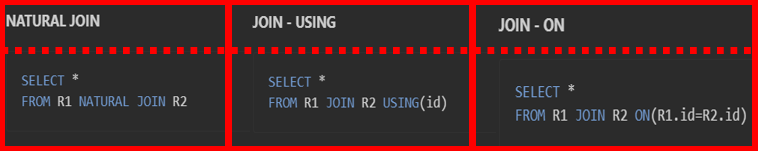
>
> ---
> **JOIN-ON**
> 
> 위의 설명을 보면 알 수 있듯이 `JOIN ON`에는 꼭 EQUI JOIN만 사용되는 것이 아닌 다양한 Condition을 설정해 줄 수 있다.
>
> 따라서 위의 3가지 예시의 결과는 모두 똑같이 출력되지 않는데, 이는 `JOIN ON`은 EQUI JOIN을 위해 만들어진 Keyword가 아니기 때문이다.
>
> 즉, `JOIN ON`의 결과 Attribute의 개수가 하나 더 많은 Relation이 반환되게 된다.<br>
> - `EQUI-JOIN` = id 
> - `JOIN ON` = R1.id, R2.id

### 2) INER JOIN vs OUTER JOIN

> **INNER JOIN (= JOIN)**
> 
> 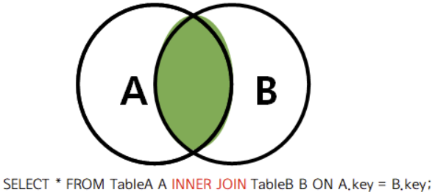
> 
> 위에서 배운 모든 JOIN은 INNER JOIN이다.<br>
> *(INNER는 생략이 가능하다)*
>  
> 즉, 왼쪽뿐만 아니라 오른쪽의 어떠한 Relation도 자신의 Tuple을 모두 Return할 필요 없다.
>
> ---
> **LEFT OUTER JOIN (=LEFT JOIN)**
>
> 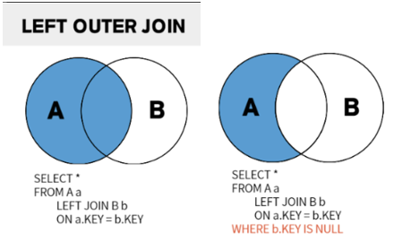
>
> LEFT OUTER JOIN은 왼쪽의 Relation의 모든 Tuple들은 반드시 다 표시해야 한다.
> *(OUTER는 생략이 가능하다.)*
> 
> 즉, 다음과 같은 과정을 통해 얻을 수 있다.
> - A의 모든 Tuple들을 적는다.
> - 이 Tuple들에 맞춰 B의 Tuple을 적는다.<br>
>   (이때, 이에 맞는 A의 값이 중복선택되는 경우 한번 더 적어 표현한다.)
>
>> <u>이 결과 A의 조건을 만족하지 못하는 B의 Tuple들은 Null값으로 채워져 나온다.</u>
> ---
> **RIGHT OUTER JOIN (=RIGHT JOIN)**
>
> 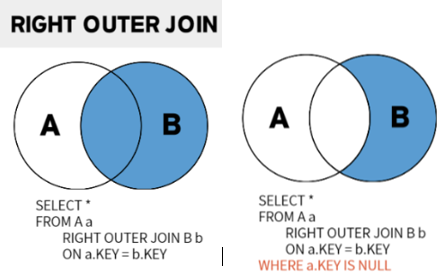
>
> RIGHT OUTER JOIN은 오른쪽의 Relation의 모든 Tuple들은 반드시 다 표시해야 한다.
> *(OUTER는 생략이 가능하다.)*
> 
> 즉, 다음과 같은 과정을 통해 얻을 수 있다.
> - B의 모든 Tuple들을 적는다.
> - 이 Tuple들에 맞춰 A의 Tuple을 적는다.<br>
>   (이때, 이에 맞는 B의 값이 중복선택되는 경우 한번 더 적어 표현한다.)
>
>> <u>이 결과 B의 조건을 만족하지 못하는 A의 Tuple들은 Null값으로 채워져 나온다.</u>
>
> ---
> **FULL OUTER JOIN**
>
> 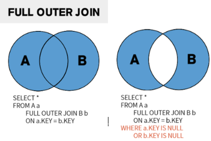
>
> Full Outer Join은 조건에 맞게 두 Relation을 합치되, 오른쪽과 왼쪽의 Relation중 누락되는 데이터가 없도록 전부 출력하는 Join연산이다.
>
>> 이는 Catesian Product와 헷갈릴 수 있지만 Full Outer Join은 특정 조건을 검사하므로 이 Catesian Product안에 속한 집합이나오게 된다.
>
> ---
> My SQL은 FULL OUTER JOIN을 지원하지 않는다.
>
> 따라서 FULL OUTER JOIN을 구현하기 위해서는 UNION연산을 활용해야한다.


---
---

# WHERE

## 1. NULL

> SQL에는 `TRUE`, `FALSE`, `NULL`의 3가지 논리 상태가 존재한다.
> 
> ---
> #### 1) 산술연산자 & 비교연산자
> 
> *산술연산자 & 비교연산자에 대해서는 모두 NULL을 반환한다.*
> 
> 1. 산술연산자
>       - `NULL + a` &rarr; `NULL`
> 2. 비교연산자
>       - `NULL > a` &rarr; `NULL`
>       - `NULL = a` &rarr; `NULL`
>       - `NULL != a` &rarr; `NULL`
>
> ---
> #### 2) 논리연산자
>
> *확실하지 않은 연산에 대해서는 모두 NULL을 반환한다.*
>
> 1. `OR`
>       - `NULL OR TRUE` &rarr; `TRUE`
>       - `NULL OR FALSE` &rarr; `NULL`
>       - `NULL OR NULL` &rarr; `NULL`
> 2. `AND`
>       - `NULL AND TRUE` &rarr; `NULL`
>       - `NULL AND FALSE` &rarr; `FALSE`
>       - `NULL AND TRUE` &rarr; `NULL`
> 3. `NOT`
>       - `NOT NULL` &rarr; `NULL`
> ---
> #### 3) IN & IS
> *`NULL`값은 `IS`연산에 대해서만 `TRUE`를 반환한다.*
>
> 1. `IN`
>       - `NULL in NULL` &rarr; `False`
>       - `NULL not in NULL` &rarr; `False`
> 2. `IS`
>       - `NULL is NULL` &rarr; `True`
>       - `NULL is not NULL` &rarr; `False`
> 

## 2. ALL & SOME

### 1) ALL vs SOME
> 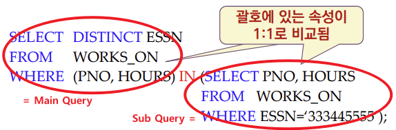
>
> ---
> **1. 연산순서**<br>
>   - `ALL`: Subquery계산 &rarr; Main Query계산
>   - `SOME`: Subquery계산 &rarr; Main Query계산
>
> --- 
> **2. 연산방법**<br>
>   - `ALL`<br>
>   : MainQuery의 Tuple을 일일이 SubQuery의 결과와 비교하여 모든 Tuple이 `TRUE`를 반환하는지 확인<br>
>   (`AND`연산으로 결과들을 합쳐 `TRUE`가 나오는지 확인)
>
>   - `SOME`<br>
>   : MainQuery의 Tuple을 일일이 SubQuery의 결과와 비교하여 모든 Tuple이 `TRUE`를 반환하는지 확인<br>
>   (`OR`연산으로 결과들을 합쳐 `TRUE`가 나오는지 확인)
>

### 2) 문자열 비교

> **`LIKE %`**: 임의의 문자가 여러개 들어갈 수 있음
>
> **`LIKE _, LIKE ?`**: 임의의 문자가 한개 들어갈 수 있음
>
> ---
> *예시*
>
> ```sql
> -- 주소가 Houston, Texas인 모든 종업원을 검색
> SELECT *
> FROM EMPLOYEE
> WHERE ADDRESS LIKE "%Houston, TX%"
>
> -- 1990년대에 태어난 모든 사원 검색
> SELECT *
> FROM EMPLOYEE
> WHERE BYEAR LIKE "199_";
>
> -- 1990년대에 태어난 모든 사원 검색
> SELECT *
> FROM EMPLOYEE
> WHERE BYEAR LIKE "199?";
> ```

## 3. IN & EXISTS

### 1) IN vs EXISTS

> 
>
> ---
> **1. 연산 순서**<br>
>   - `IN`: Subquery계산 &rarr; Main Query계산
>   - `EXISTS`: MainQuery계산 &rarr; Subquery계산
>
> ---
> **2. 연산 방법**<br>
>   - `IN`: MainQuery의 Tuple을 일일이 SubQuery의 결과와 비교하여 True를 반환하는 Tuple이 있는지 확인
>   - `EXISTS`: MainQuery를 계산하며 각 Tuple을 Subquery에 대입했을 때, Subquery의 결과가 존재하는지 확인
>
>> 즉, `EXISTS`는 공집합인지에 대한 여부만 파악하기 때문에 `IN`보다 연산수가 더 적고 따라서 더 빠르다.

### 2) ANTI JOIN & SEMI JOIN

> **ANTI JOIN**
> 
> ```sql
> SELECT *
> FROM EMPLOYEE a, DEPARTMENT b
> WHERE a.bid = b.id AND NOT IN(
>     SELECT b.id
>     FROM department
>     WHERE maneger is NULL
> );
> ```
> 
> SubQuery에는 없는 메인 쿼리 결과 데이터만 추출하는 것
>
>> <u>`NOT IN`이나 `NOT EXISTS` 연산자를 통해서 구현 가능하다.</u>
>
> *(`NULL` 값의 존재로 인해 의미론 적으로는 `ANTI JOIN`을 쓸 때, `IN`이나 `NOT IN`을 쓰는 것이 맞다.)*
> 
> ---
> **SEMI JOIN**
>
> ```sql
> SELECT *
> FROM EMPLOYEE a, DEPARTMENT b
> WHERE a.bid = b.id AND IN(
>     SELECT b.id
>     FROM department
>     WHERE maneger is NOT NULL
> );
> ```
>
> SubQuery에 있는 메인 쿼리 결과 데이터만 추출하는 것
>
>> <u>`IN`이나 `EXISTS` 연산자를 통해서 구현 가능하다.</u>
> ---

---
---
# SELECT

## 1. Aggregate Function

SELECT문에서는 다음과 같은 함수들을 사용할 수 있다.

- DISTINCT : 중복을 제거하여 Return
- ALL(생략가능) : 중복제거없이 Return
- 산술식 : 산술식을 적용하여 Return

이때, 결과 값으로 단일값을 내놓는 함수들이 있는데 이러한 함수들을 Aggregate Function이라고 한다.

### 1) Function

> - COUNT()
> - SUM()
> - MAX()
> - MIN()
> - AVG()

### 2) GROUP BY & HAVING

> ```sql
> SELECT AVG(salary)
> FROM INSTRUCTOR
> WHERE salary > 80000
> GROUP BY dept_name
> HAVING count(dept_name) <= 2; //count는 Aggregate함수
> ```
> 
> ---
> **GROUP BY**
>
> 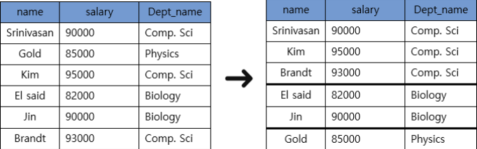
> 
> 1. 목적<br>
>   : Aggregate Function을 Relation 전체가 아닌 Group별로 적용하기 위해서 사용
> 
> 2. 주의점<br>
>   : Group By를 사용한 경우 반드시 SELECT에서 Aggregate Function을 사용해 주어야 한다.
>
> ---
> **HAVING**
> 
> 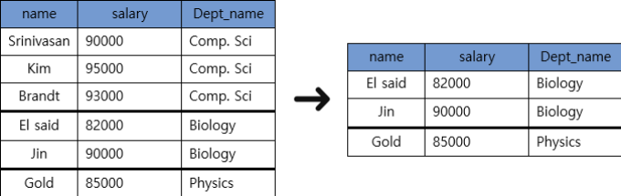
>
> 1. 목적<br>
>   : WHERE절은 Group By이전에 해석되기 때문에 Group으로 나눈 후에는 Group의 조건을 설정할 수 없다.<br>
>   : 즉, 골라내고 싶은 Group의 조건이 있을때 사용한다.
> 
> 2. 주의점<br>
>   : Group By가 있을 때만 사용 가능하다.
>
> ---
> **SELECT**
>
> 1. 목적<br>
>   : Project의 역할을 한다. <br>
>   : 즉, 모든 선택을 마친 뒤 결과로 보여줄 Attribute를 고르기 위해 사용한다.
> 
> 2. 주의점<br>
>   : 만약 Aggregate함수를 사용하였고 이때 중복을 제거해야 하는 경우 `DISTINCT` Keyword를 잘 사용해 주자

### 3) Aggregate 함수의 NULL처리
>
> 1. `count`함수가 아닐 경우
>    - 모두 null일 경우: 결과도 null 
>    - null이 아닌 것이 있는 경우: null을 제외한 나머지에 대해 함수 수행
>
>
> 2. `count`함수의 경우
>    - `count(*)`의 경우 *(null을 제외하지 않고 셈)*
>       - 모두 null일 경우: Row의 수 
>       - null이 있을 경우: Row의 수
>    - `count(A)`의 경우 *(0부터 null을 제외하고 셈)*
>       - 모두 null일 경우: 결과는 0
>       - null이 있을 경우: null을 제외하고 셈

## 2. Order By

> ```sql
> select name, salary, Dept_name
> from instructor
> where salary > 80000
> order by salary desc; //order by salary asc
> ```
> ---
> 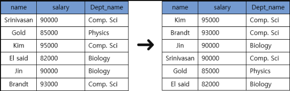
>
> 1. 목적<br>
>   : 모든 Instance선택을 마치고 결과Relation을 출력할 때, 정렬된 결과를 보고 싶은 경우 사용한다.
>
>
> 2. 사용법(오름차순, 내림차순)<br>
>   `ORDER BY A ASC`: A를 기준으로 오름차순으로 정렬하여 출력한다.
>   *(이 경우 asc는 생략가능)*<br>
>   `ORDER BY A DESC`: A를 기준으로 내림차순으로 정렬하여 출력한다.
>
> 3. 옵션(정렬기준 여러개 설정)<br>
>   `ORDER BY A, B DESC, c`: 이런 방식으로 정렬기준의 우선 순위를 설정할 수 있다. *(A,C 오름차순, B내림차순)*


# RELATION
EXCEPT
UNION
INTERSECT

# ASSERTION, TRIGER, VIEW 

## 1. ASSERTION
: Relation들이 만족해야 하는 조건 설정
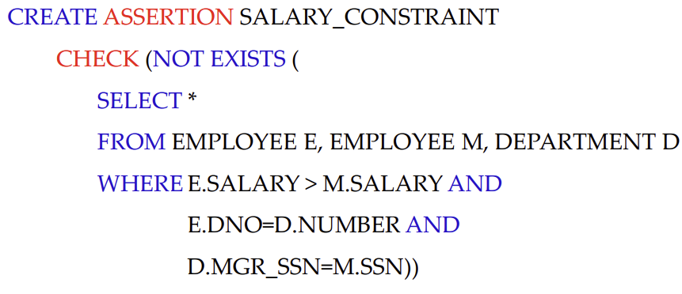

## 2. TRIGER
: insert나 update시 조건 검사
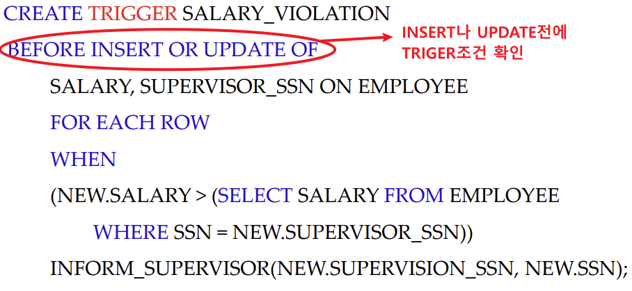

## 3. VIEW
가상의 Table 생성
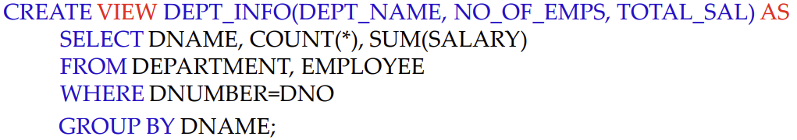