앞에서는 DataBase를 사용하는 방법에 대해서 알아보았다면, 여기서는 DataBase를 어떻게 설계해야 하는지, 즉 DataBase의 Schema를 어떻게 만들지에 대한 생각을 해보는 부분이다.

이를 위해서 Entity-Relationship Model이라는 개념을 도입하게 되는데, 이 E-R Model을 먼저 만들고, 이를 통해 Relational Model을 만들게 된다.

즉, E-R Model이 무엇인지배우고, 이를통해 E-R Diagram을 만들고, 이 E-R Diagram으로부터 Relational Model을 만드는 방법을 살펴볼 것이다.

---
# E-R Model
E-R Model은 다음과 같이 DataBase를 Entity와 Relationship으로 나누어 생각하는 방법이다.

이 때, DataBase를 설계하는 단계이기 때문에 앞에서 배웠던 Relational DataBase의 속성과는 다른 점이 있을 수 있다.
(예를들어 E-R Model에서는 Atomic하지 않은 Data도 허용한다.)

따라서 일단 우선은 E-R Model이 Relational DataBase와 다르다는 것을 인지하고, 이 E-R Model이 어떻게 Relational DataBase로 변해가는지에 초점을 맞추어야 할 것 같다.

---

## 1. Entity & Relation

.png)

*(Entity Set)*

.png)

*(Relation Set)*

### 1) Entitiy & Entity Set

> **Entity**
>
> 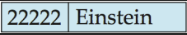
> 
> Entity는 위의 데이터를 실체화한 대상이다. 즉, Data에 실제로 들어가는 값들이라고 생각할 수 있다.
>
> 
> - **Attribute** 
>     : 모든 Entity들은 Attribute를 가진다. 
>     *(예를들어 위의 예시에서 Einstein이라는 교수가 있다고 해보자. 이 때 `Einstein`이라는 Entity는 `ID`, `name`, `salary`라는 Attribute를 가진다.)*
> 
> - **Attribute의 Domain** 
>  : 이 Attribute에는 Domain이 존재하는데 `varchar`, `int`와 같이 구체적인 값이 아니라 추상적인 개념으로 접근해보자.
>     - 1. **Simple & Composite** 
>        : 단일 값을 갖는 데이터 or 여러 데이터가 구조를 이루어 형성된 하나의 데이터 
>     *(ex. name은 firstname과 lastname으로 이루어져있다.)* 
>     *(ex. Address는 Street, City, State로 이루어져 있다.)*
>     - 2. **Single-Valued & Multi-Valued** 
>        : 단일 값을 갖는 데이터 or 여러 데이터를 한번에 입력할 수 있는 데이터 
>     *(ex. 한명이 여러개의 Phone number를 가질 수 있다.)*
>     - 3. **Derived** 
>        : 다른 Attribute를 통해 유추할 수 있는 데이터를 의미한다 
>     *(ex. age라는 Attribute는 birth라는 Attribute로 부터 추측이 가능하다.)*
>
>
> *(참고)* 
> *: 후에 Relational Model에서는 Simple하고 Single-Valued인 데이터만 남게된다*.
>
> ---
>**Entity Set (->Relation)**
>
> .png)
>
> Entity Set은 Entity들이 모여있는 집합을 의미한다.  
> 즉 이 Entity Set은 후에 몇가지 과정을 거쳐 테이블이되고, Entities는 이 Table의 Tuple이 된다.
>
> 
> - **Key** 
>  : Relational Model과 마찬가지로 E-R Model의 EntitySet도 Key를 가진다. 
>  *(Primary Key, Candidate Key, Super Key)*

---
### 2) Relationship

> **Relationship**
>
> 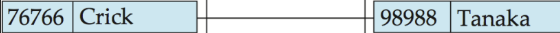
> 
> Relationship은 Entity들이 관계를 맺고 있다는 것을 의미한다.
>
> 흔히 착각할 수 있는 점 중 하나는 Relation을 하나의 현상이라고 이해하면 안되고, 하나의 Data라고 생각해야한다.
>
> - **Attribute** 
>  : Relationship도 하나의 Data이기 때문에 Attribute를 가진다. 
>  : 이 Attribute에는 관계를 형성한 두 Entity의 Attribute가 포함될 수 있고, 이 외에도 관계를 표현하는 추가적인 Attribute가 있을 수 있다. 
>  *(예를들어, 위의 Crick라는 교수와 Tanaka라는 학생의 관계는 `Instructor.name`, `Student.name`, `Intimacy` 등으로 표현할 수 있을 것이다.)*
> 
> ---
> **Relationship Set**
>
> .png)
> 
> Relationship들이 모여있는 집합을 의미한다.
이 때, 이 Relationship Set가 어떻게 형성되었는지에 따라서 degree와 Cardinality라는 속성이 결정된다. 
>
> 뒤의 RelationShip의 특성을 본 후에 이 부분을 보도록 하자.
>
> - **Primary Key** 
> : EntitySet과 마찬가지로 RelationshipSet도 하나의 Data Set이므로 Key를 가진다. 
> : 이때, Relationship은 참여하고 있는 두 Entity들로만 Identify될 수 있을 것임을 명심하자. 
> (즉, 관계를 설명하기 위한 추가적인 Attribute를 위해 Relationship을 만드는 것이 아니다.)
>
> - **Primary Key를 정하는 방법** 
> : 이때 이 Primary Key를 정하는 방법은 다음과 같다.
>     - 1. **One to One** 
>         : <u>두 EntitySet의 Primary Key중 하나의 Primary Key로 선택한다.</u> 
>         *(One to One Relationship은 한쪽의 한 Entity만 있더라도 Relationship을 정의할 수 있기 때문)*
>     - 2. **Many to One** 
>        : <u>Many를 담당하는 EntitySet의 Primary Key를 Primary Key로 선택한다.</u> 
>        *(Many to Many Relationship은 Many쪽의 Entity가 있어야 Relationship을 정의할 수 있기 때문)*
>     - 3. **Many to Many** 
>        : <u>두 EntitySet의 PrimaryKey를 합쳐 Primary Key로 정한다.</u> 
>        *(Many to Many Relationship은 양쪽 모두의 Entity가 있어야 Relationship을 정의할 수 있기 때문이다.)*

---
## 2. Relationship Set의 특성

### 1) Degree

> 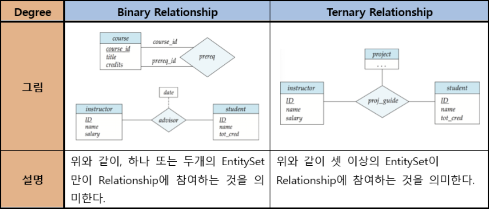

### 2) Cardinality

> Cardinality는 관계를 정의하는데 필요한 Entity의 Maximum Number를 의미한다.
> 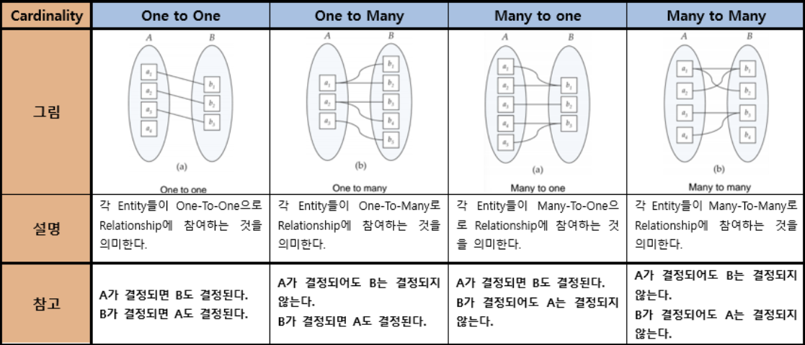
>
> 즉, Many부분에서는 N개 이하의 Entity가 관계에 참여한다는 뜻이고, 
> One부분에서는 오직 한개의 Entity만 관계에 참여한다는 뜻이다.
> 
> ---
> **표현방법**
>
> 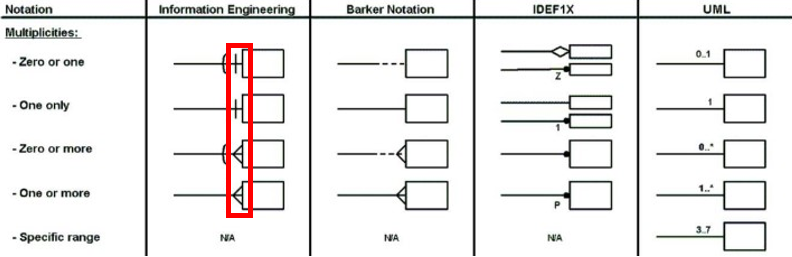
>
> ---
> **My SQL**
>
> 다리가 많은 쪽이 `many`의 역할을 하고, 하나만 있으면 `one`의 역할을 한다.
>  
> 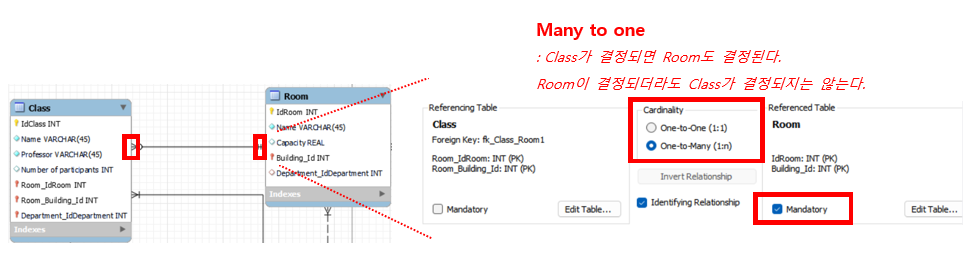

### 3) Participation

> Total Participation과 Partial Participation은 관계를 정의하는데 필요햔 Entity의 Minimum Number를 의미한다.
> 
> 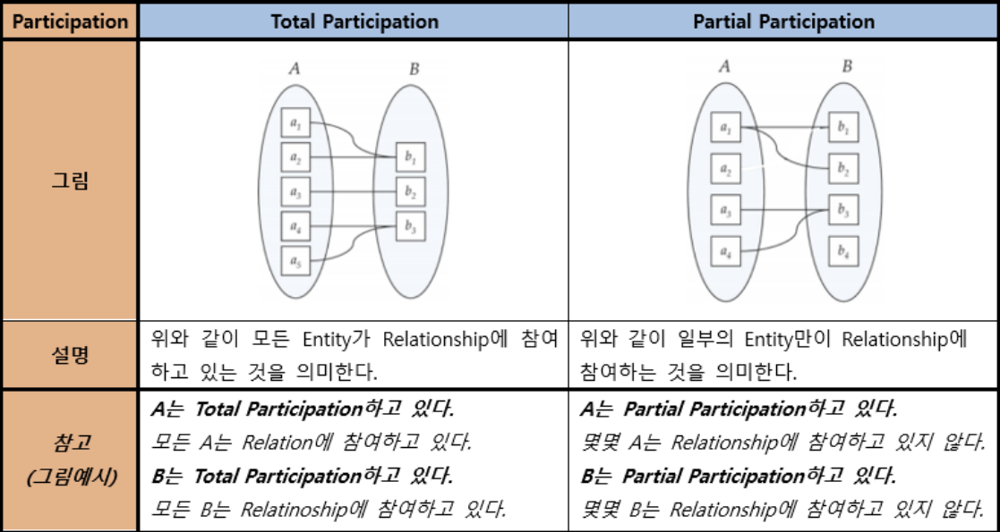
> 
> 즉, Total Participation은 1이상의 Entity가 관계에 참여한다는 뜻이고 
> Partial Participation은 0이상의 Entity가 관걔에 참여한다는 뜻이다.
>
> ---
> **표현방법**
>
> 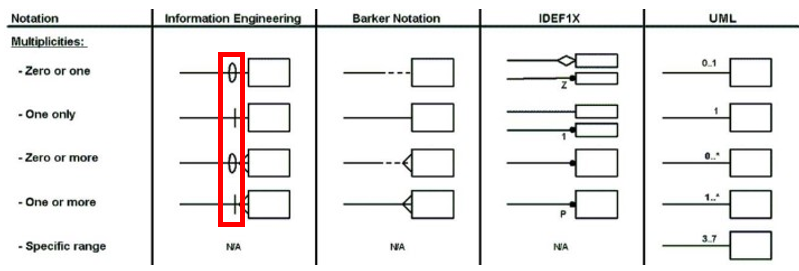
>
> ---
> **My SQL**
>
> Mysql의 Workbench에서는 `Mandatory`라는 항목으로 `Participation`을 표현하고 있다.
>
> 
> 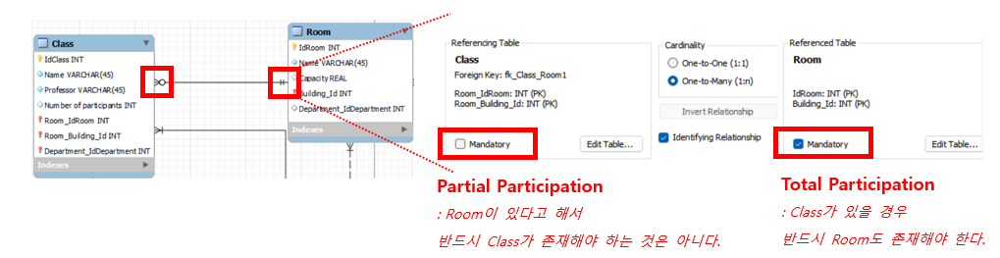

### 4. Strong EntitySet과 Weak EntitySet

> E-R Model에는 중복된 Attribute가 각 Entity에 존재하면 안된다는 규칙이 있다. 즉, 다음과 같이 중복된 Attribute가 있을 경우 한쪽을 지워주고, 이를 Relation으로 표현해야 한다.
>
> 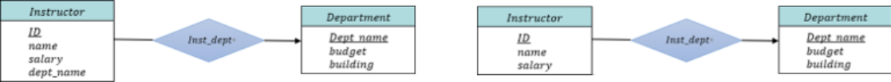
>
> 이 때, 위의 경우에서는 겹치는 Attribute가 지워지는 쪽에서 Primary key를 구성하지 않았으므로 문제가 되진 않는다. 
>
> 하지만, 만약 그렇지 않다면, 한 EntitySet에 의해 다른 EntitySet이 결정되는 관계가 되어버린다.
>
> 즉, 이렇게 다른 EntitySet에 의존하는 EntitySet을 Weak EntitySet이라고 하고 그렇지 않으면 Strong EntitySet이라고 한다.
>
> 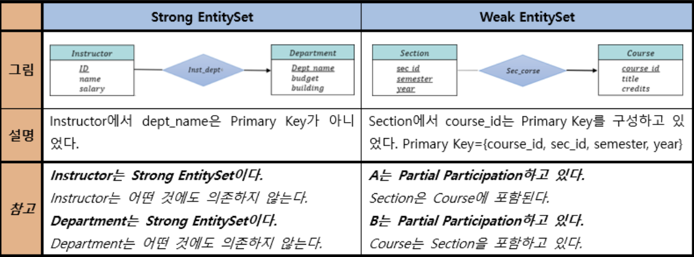
>
> 이 때, Weak EntitySet의 Primary Key는 더이상 제역할을 하지 못한다.  
> 즉, 해당하는 Strong Entity Set의 Primary Key와 합쳐져야 Primary Key의 역할을 할 수 있다.
>
> **이 Weak EntitySet의 PrimaryKey를 Partial Key혹은 discriminator라고 한다.**
>
> ---
> **표현방법**
>
> ---
> **My SQL**
> 
> Mysql의 Workbench에서는 `Identifying Relationship`이라는 항목으로 `Weak Entity`를 표현하고 있다.
> 
> 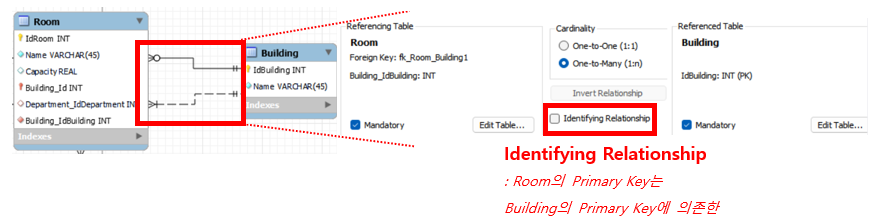

---
## 3. E-R Diagram

