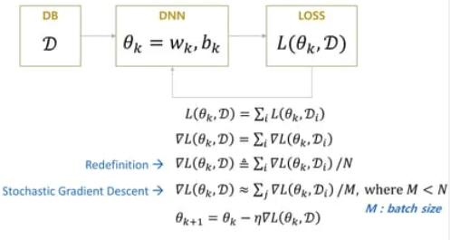
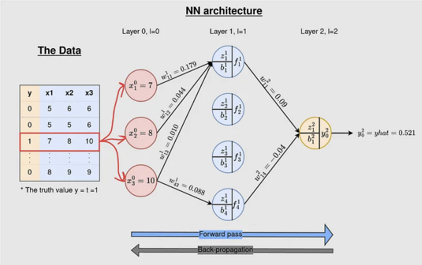
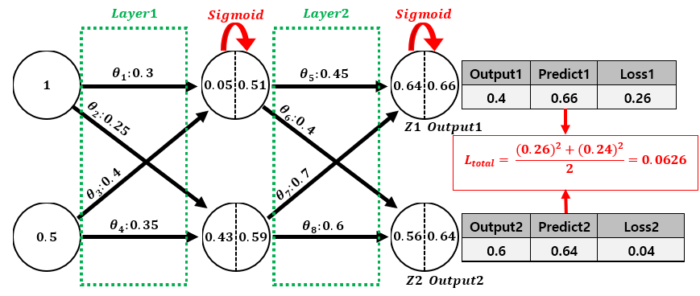
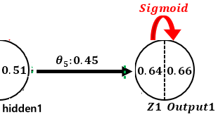

# 머신러닝

## 1. 개요 
### 1) 동작 과정
>
입력
: 데이터
>
>
모델
: svm, random forest등 
: deep learning 모델
>
>
출력
: 데이터로부터 생성할 수 있는 정보

### 2) 학습 과정
>
모델이 가지고 있는 파라미터를 수정해 나아가는 과정
>
----
파라미터를 수정하기 위해 정해야 할 것
1. 모델
2. loss function
: 데이터를 우리의 모델로 가공한 결과와, 실제 생성했어야 할 결과에 대한 차이를 어떻게 규정할 것인지ㅣ 정해야 ㅎ함
>
---
학습
모델을 규정짓는 파라미터를 수정해 나가면서 우리가 정한 loss가 최소화 되는 파라미터를 찾는 과정

---
## 1. Loss Function 설정

> **Loss Function의 정의**
> 
> 이미 Deep Learning을 배웠던 사람들이라면 다음의 가정들은 당연하다고 생각할 수 있다.
>
> 하지만 우리는 언제나 그렇듯 당연한 만큼 소홀이 할 수 있기 때문에 한번 더 짚고 넘어가자.
>
>> 1. $L(f_\theta(x), y)$ 
> **: Loss를 구할 때에는 네트워크의 최종 출력과 정답만을 가지고 구해야 한다.**
>
> *즉, 네트워크의 중간 출력값을 통해서 Loss Function을 구성할 수는 없다. 
> (후에 GoogleNet이라는 딥러닝 모델을 배울 때, 이 부분을 유의해서 공부해 보자)*
>
>
>> 2. $L(f_\theta(x), y) = \displaystyle\sum_{i}L(f_\theta(x_i), y_i)$ 
> **: 학습 데이터 전체에 대한 Loss값은, 각각의 학습 데이터의 Loss값의 합과 같다.**
>
>
> $f$: 모델 
> $\theta$: 모델의 파라미터 
> $x$: 입력(학습) 데이터 
> $y$: 입력 데이터에 대한 정답 값 
>
> ---
> **Loss Function의 종류**
>
> - mse, rmse
>
> - cross entropy
>
> - Label Smoothing 
>
> - focal loss
>
> - dice loss 

---
## 2. Forward Propagation(예측)

### 1) activation function

---
## 3. Back Propagation(학습)

### 1) Gradient Descent

> 2번에서 Loss Function을 정했으니 이제 어떻게 $\theta$*(모델의 파라미터)*를 변경하여 Loss값을 줄일 수 있는지 알아보자.
> 
> ---
> **Gradient Descent(Continuous Space)**
>
> 이 방법에 대한 힌트는 Taylor Expansion에서 부터 시작한다. 
> 먼저 우리가 잘 알고 있는 Taylor Expansion의 수식은 다음과 같다.
>
>> 1. **Taylor Expansion** 
>> : 어떤 함수 $f(x)$가 무한번 미분 가능한 함수라고 할 때, 다음과 같은 다항함수로 표현할 수 있고, 이를 a에서 $f(x)$의 테일러 급수라고 한다. 
>> $f(x)=f(a)+\frac{f'(a)}{1!}(x-a) + \frac{f''(a)}{2!}(x-a)^2 + \frac{f^{(n)}(a)}{n!}(x-a)^n + ...$ 
>
>
> 이때, 여기서 $x=a+\Delta a$라고 하면,  
> $f(a + \Delta a)-f(a) = \nabla f \Delta a + \frac{\nabla^2f\Delta a^2}{2!} + ...$ 라고 다시 쓸 수 있다.
>
>> 2. **Approximation** 
>> : Taylor Expansion에서 $a$를 $\theta$, 그리고 $f$를 $Loss function$ 로 놓고 우항의 1번째 항까지만 사용하여 근사한다면, 
>>$L(\theta + \Delta \theta)-L(\theta) = \nabla L \Delta \theta$ 이다.
>
> 이때, 우리는 모델의 파라미터 $\theta$를 바꾸었을 때, Loss값이 줄어들기를 원한다. 
> 즉, $L(\theta) > L(\theta + \Delta \theta)$가 되기를 원한다.
>
>> 3. **Gradient Descent** 
>> : 따라서, 만약 $\Delta \theta = -\eta \nabla L$라고 설정한다면,  
$L(\theta + \Delta \theta)-L(\theta) = -\eta ||\nabla L ||^2$ 이 되어 항상 음수가 된다.
>
> 이때, 우리는 Taylor 급수를 근사하여 위 식을 구하였기 때문에,  
> $\Delta \theta = 0$에 근사할 때에만 위의 식은 성립하게 된다.
> 
>> **즉, learning rate라고도 불리는 적절한 $\eta$의 값을 설정해 위의 식이 성립하도록 해 주어야 한다.**
>
> ---
> **Gradient Descent(Discrete Space)**
>
> Taylor 급수를 통해 모델의 Loss Function의 값을 줄이기 위해서는 $\Delta \theta$를 $-\eta \Delta L$로 설정해야 한다는 것을 알았다.
>
> 이제 다시 Loss Function을 Update하는 방법을 알아보자.
>
>> 1. **Loss** 
>> $L(\theta_k, x) = \sum_i L(\theta_k, x_i)$ 
> : Loss Function에 대한 조건 2로 인해 성립한다.
>> ---
>> 2. **Gradient Descent** 
>> $\nabla L(\theta_k, x) = \sum_i \nabla L(\theta_k, x_i) \overset{\triangle}= \sum_i \frac{ \nabla L(\theta_k, x_i)}{N}$ *(N은 전체 Sample 수)* 
>> : N으로 나누어 전체 샘플에 대한 $\nabla L$값의 평균을 구해도 이 값이 음수가 된다는 사실은 변하지 않기 때문에 나누어 주어도 상관 없다.
>> ---
>> 3. **Stochasic Gradient Descent** 
>> $\nabla L(\theta_k, x) = \sum_i \nabla L(\theta_k, x_i) \overset{\triangle}= \sum_i \frac{ \nabla L(\theta_k, x_i)}{M}$ *(M은 Batch Size, M\<N)* 
>> : M으로 나누어 구한 일부 샘플에 대한 $\nabla L$값의 평균은 
>> N으로 나누어 구한 전체 샘플에 대한 $\nabla L$값의 평균과 유사하다.
>> ---
>> 4. **Update** 
>> $\theta_{k+1} = \theta_k - \eta \nabla L(\theta_k, x)$

### 2) Back Propagation

> 인공지능의 역사를 보면 크게 2번의 침체기가 있었다. 이를 인공지능의 겨울이라고 한다.
>
> - 1번째 겨울 
>   - Cause 
>   : **XOR Problem** 
>   : Perceptron이 직선으로 밖에 표현되지 못해 나타나는 현상.
>   - Solution 
>   : **Activation Function** 
>   : 비 선형 함수의 도입으로 해결
>
> - 2번째 겨울 
>   - Cause 
>   : **Gradient Descent의 연산량** 
>   : 층이 조금만 깊어져도 매우 많은 연산량이 발생함
>   - Solution 
>   : **Back Propagation Algorithm** 
>   : Chain Rule을 활용한 BackPropagation Algorithm을 통해 해결
>
> ---
> **Chain Rule**
>
> 
>
> ([연쇄법칙 증명](https://vegatrash.tistory.com/17))
>
> ---
> **Back Propagation**
> 
>
> $if Loss Function=MSE, $ 
> $if Activation Function=Sigmoid$ 
>           
>  1. **Layer2 Update** 
>    
>   : $\frac{\delta L_{total}}{\delta \theta_5} = \frac{\delta L_{total}}{\delta output_1} * \frac{\delta output_1}{\delta Z_1} * \frac{\delta Z_1}{\delta \theta_5}$ 
>       - $\frac{\delta L_{total}}{\delta output_1} = \frac{\delta }{\delta output_1} MSE(target_, output)$
>       - $\frac{\delta output_1}{\delta Z_1} = \frac{\delta}{\delta Z_1}Sigmoid(Z_1)$
>           
>
>
>
>
>
>
> ([참고페이지](https://wikidocs.net/37406))

---
## 4. Maximum Likelihood

### 1) Loss Function을 보는 관점
>
다양한 Loss Function들이 존재한다. 
이때, Loss Function을 어떤 것으로 정해야 하는가? 에 대한 것은 크게 다음의 두 관점에서 대답되어 진다.
>
---
#### 1. BackPropagation의 동작
>
Cross Entropy > MSE
>
---
#### 2. 출력값이 Continuous한가
>
(==Maximum Likelihood관점)
>
Network 출력값이 Continuous하다
MSE > Cross Entropy
>
>
>
discrete하다 (ex. classification)
Cross Entropy > MSE
>

위 내용은 이활석님의 [오토인코더의 모든 것 -1/3](https://www.youtube.com/watch?v=o_peo6U7IRM&t=450s)의 강의를 참고하였습니다.

---
## hard nevative mining