# Interrupt1

## HW1. Following events will cause interrupts in the system. What interrupt number will be assigned to each event? For system call interrupt, also give the system call number.

> - **A packet has arrived**<br>
>   (Interrupt Number 42): 네트워크 인터페이스에 해당된다.
>
> - **An application program calls `scanf()`**<br>
>   (Interrupt Number 128, System Call Number 3): 시스템 콜 read에 해당된다.
>
> - **A key is pressed**<br>
>   (Interrupt Number 33): Keyboard Interrupt에 해당된다.
>
> - **An application causes a divide-by-zero error**<br>
>   (Interrupt Number 0): divide-by-zero Exception에 해당된다.
>
> - **An application program calls printf()**<br>
>   (Interrupt Number 128, System call Number 4): 시스템 콜 write에 해당된다.
>
> - **An application causes a page-fault error**<br>
>   (Interrupt Number 14): Page fault Exception에 해당된다.

---
## HW2. Change "drivers/input/keyboard/atkbd.c" as follows. What happens and why does this happen? Show the sequence of events that happen when you hit a key in a normal Linux kernel
```cpp
Static irqreturn_t atkbd_interrupt(…){
    return IRQ_HANDLED; // Add this at the first line
    ….
}
```

> **Result**
>
> 아래의 사진과 같이 atkbd_interrupt함수의 첫번째 줄에서 바로 return을 하도록 해 주었다.
>
> 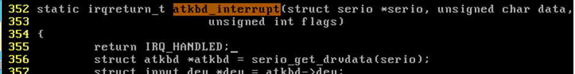
>  
> 그리고 이 내용이 Kernel에 실제로 반영될 수 있도록 하기 위해서 다음과 같이 변경 내용을 컴파일 해 준뒤, 생성된 파일을 `myLinux`에 실제 적용될 수 있도록 이동해 주었다.
> ```cmd
> # make bzImage
> # cp arch/x86/boot/bzImage /boot/bzImage
> # reboot
> ```
> 그 결과 로그인 창에서부터 키보드 입력이 되지 않는 것을 확인할 수 있었다.
>
> ---
> **원인**
> 
> `drivers/input/keyboard/atkbd.c/atkbd_interrupt()`는 Keyboard Interrupt의 ISR2(Interrupt Service Routine)의 동작코드가 존재하는 곳이다.
> 
> 기존 코드에서는 키보드 입력에 대한 Interrupt 처리를 하는데 이는 다음과 같다.
>
> - 키보드 입력 기억
> - 기억한 입력을 시스템에 저장
> - 기억한 입력을 screen에 출력
> 
>  즉 이 과정 후에 `IRQ_HANDLED`를 반환하지만, 우리가 고친 코드에서는 키보드 입력에 대한 처리 과정 없이 완료가 되므로 아무런 문자가 Screen에 표시되지 않는 것이다.

---
## HW3. Change the kernel such that it prints “x pressed” for each key pressing, where x is the scan code of the key. After you change the kernel and reboot it, do followings to see the effect of your changing.

> **Code**
>
> 우선 Keyboard Interrupt를 처리하는 `drivers/input/keyboard/atkbd.c/atkbd_interrupt()`부분을 다음과 같이 고쳐 주었다.
> 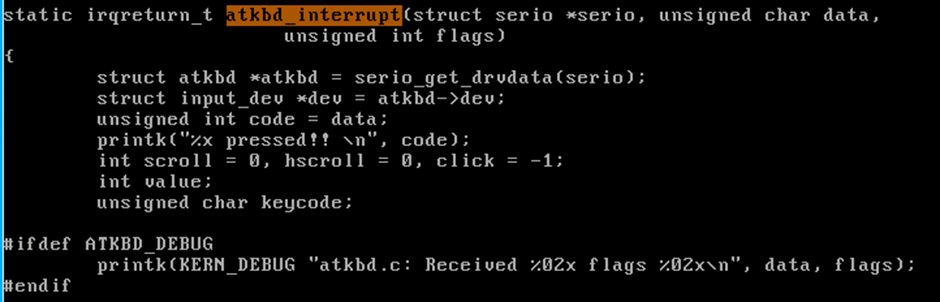
>
> 즉, `printk("%x pressed\n", code);`부분을 통해 내가 Keyboard로 입력한 data를 출력 할 수 있도록 바꾸어 주고 마찬가지로 컴파일하여 Kernel에 적용될 수 있도록 해 주었다.
> 
> ```cmd
> # make bzImage
> # cp arch/x86/boot/bzImage /boot/bzImage
> # reboot
> ```
>
> ---
> **Setting**
> 
> 이 경우 해당 내용이 바로 적용되지는 않았는데, 이 이유는 현재 콘솔의 log level이 printk함수의 log level보다 작기 때문에 출력되는 문자들이 콘솔 화면에 나타나지 않게 된다.
>
> default log level은 다음 명령어를 통해 확인할 수 있다.
> 
> `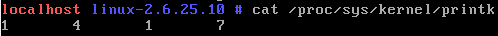
>
> 그 결과 출력은 위와 같이 1, 4, 1, 7로 나타나는 것을 확인할 수 있고 이 결과는 순서대로 다음을 의미한다.<br>
>
> - `Console log level`: 이 값보다 숫자가 작은 메시지들을 Console에 출력<br>
> - `Default Message log level`: 우선순위가 없는 message들의 Log Level, printk함수를 사용하면서 별도의 Log Level을 사용하지 않을 경우 이 값으로 설정된다.<br>
> - `Min Console log level`: Console Log Level이 설정될 수 있는 최솟값<br>
> - `Default Console log level`: Console Log Level용 기본 값<br>
> 
> 즉, 여기서 Default Message log level이 Console log level보다 컸기 때문에 printk의 내용이 콘솔에 출력되지 않았던 것이므로 Console log level을 8로 설정해 주었다.
>
> 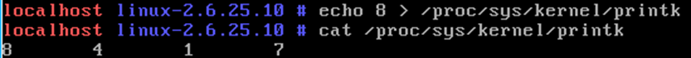
>
> ---
> **Result**
>
> 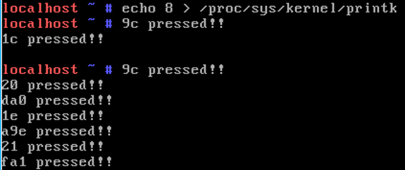

---
## HW4. Change the kernel such that it displays the next character in the keyboard scancode table. For example, when you type "root", the monitor would display "tppy". How can you log in as root with this kernel?

> **Code**
>
> 마찬가지로 Keyboard Interrupt를 처리하는 `drivers/input/keyboard/atkbd.c/atkbd_interrupt()`부분을 다음과 같이 고쳐 준다.
> 
> 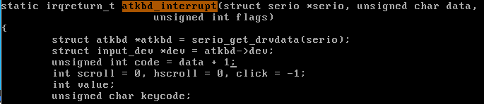
> 
> 그 후 마찬가지로 변경 내용을 Kernel에 적용해 준다
>
> ```cmd
> # make bzImage
> # cp arch/x86/boot/bzImage /boot/bzImage
> # reboot
> ```
> 
> ---
> **Result**
> 
> 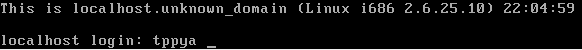
>
> 위 그림과 같이 root를 입력하면 tppy가 입력되는 것을 확인할 수 있다.
>
> *(참고): 따라서 root로 로그인하기 위해서는 scan code table에서 1이 작은 eiir을 입력하여야 한다.*

--- 
## HW5. Define a function "mydelay" in init/main.c which whenever called will stop the booting process until you hit 's'. Call this function after do_basic_setup() function call in kernel_init() in order to make the kernel stop and wait for 's' during the booting process. You need to modify atkbd.c such that it changes exit_mydelay to 1 when the user presses 's'.

> **Code**
> 
> 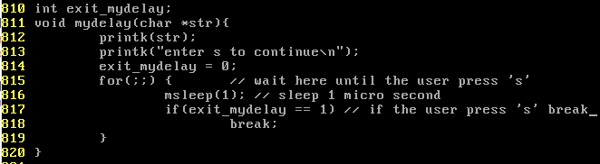
>
> 우선 `init/main.c`에 위와 같은 함수, global변수를 선언해 준다.<br>
> 이 함수는 keyboard에 `s`가 눌릴 때까지 sleep하도록 하는 함수이다.
>
> 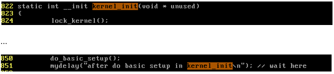
>
> 그리고 `init/main.c/kernel_init()`함수의 `do_basic_setup();`코드 밑에 위에서 선언해준 mydelay함수를 실행하도록 해 준다.
> 
> 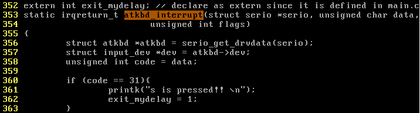
>
> 이 후, Keyboard Interrupt를 처리하는 `drivers/input/keyboard/atkbd.c/atkbd_interrupt()`부분을 위와 같이 고쳐 주어 `s`에 해당하는 31번 Keyboard가 입력되면 `exit_mydelay`가 1이 되도록 고쳐 주었다.
>
> 마지막으로 변경 내용을 Kernel에 적용해 준다
>
> ```cmd
> # make bzImage
> # cp arch/x86/boot/bzImage /boot/bzImage
> # reboot
> ```
>
> ---
> **Result**
>
>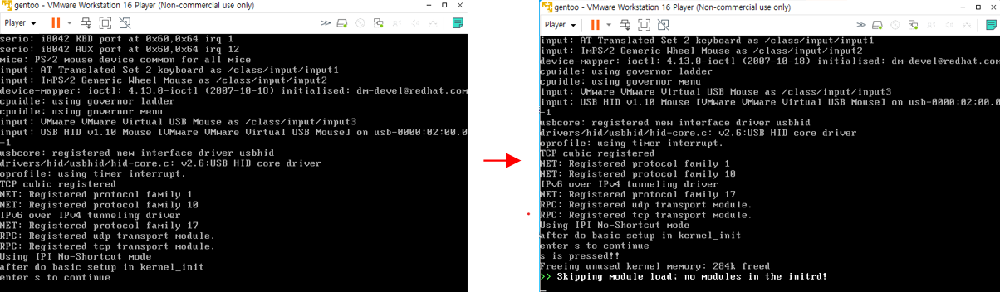
> 
> 그 결과 위와 같이 keyboard에 `s`를 누르기 전에는 booting이 되지 않고 대기하고 있는 것을 확인할 수 있었다.
>
>

### HW5-1) Add mydelay before do_basic_setup(). What happens and why? 

> **Code**
>
> 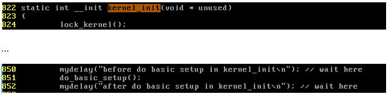
> 
> 이번에는 위와 같이 `do_basic_setup();`함수 위에 `mydelay()`함수를 실행하도록 추가적으로 설정해 보았다.
>
> ---
> **Result**
>
>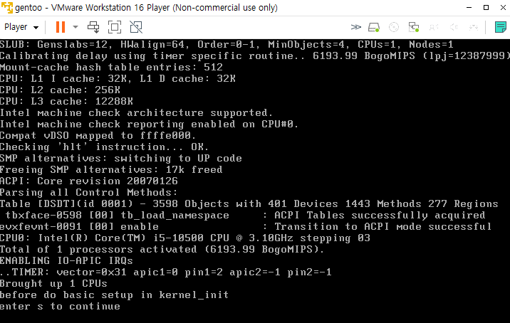
> 
> 그 결과 Keyboard에 `s`를 입력해도 전혀 booting이 되지 않는 것을 확인할 수 있었다.
>
> ---
> **원인**
> 
> do_basic_setup을 살펴보면 다음과 같다.
>
> 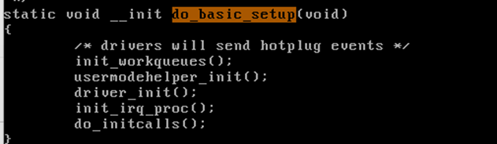
> 
> 즉, Driver를 초기화 하고 있는데, 여기서 정적인 디바이서 드라이버 파일들을 등록(초기화)하기 때문에 do_basic_setup전에는 운영체제가 키보드, 마우스, 디스크와 같은 디바이스들과 상호작용을 할 수 없다.

---
## HW6. Which function call in atkbd_interrupt() actually displays the pressed key in the monitor?

> **Code**
> 
> 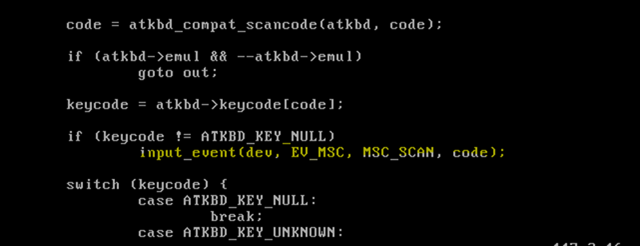
>
> `drivers/input/keyboard/atkbd.c/atkbd_interrupt()`함수를 살펴보면 위와 같이 키보드 Input이 있을경우 `input_event()`함수를 호출하고 있는 것을 확인할 수 있다.
>
> 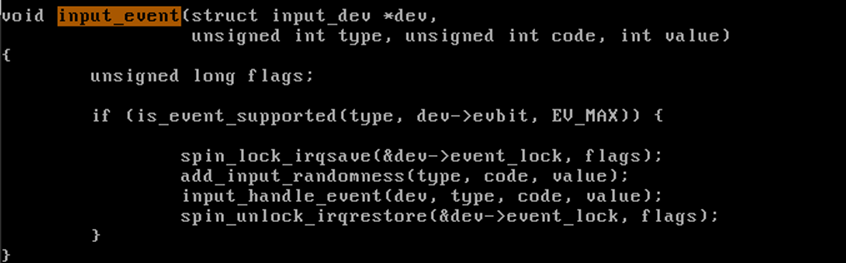
>
> 이 코드는 `drivers/input/input.c`에 위치하고 있고, 내용을 보면 다시 `input_handle_event()`함수를 호출하고 있는 것을 확인할 수 있다.
> 
> 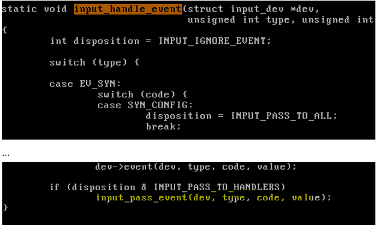
>
> 이 코드는 다시 입력(diposition)이 있을 경우 `input_pass_event()`함수를 호출한다.
>
> 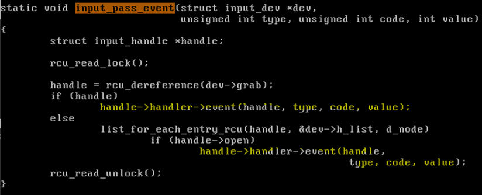
> 
> 마지막으로 이 함수를 보면 `handle->handler->event(handle, type, code, value)`를 호출하여 실질적인 이벤트 핸들을 진행하는 것을 확인할 수 있다.
> 
> 누른 키를 모니터에 표시하게 된다.

### HW6-1. What are the interrupt numbers for divide-by-zero exception, keyboard interrupt, and "read" system call? Where is ISR1 and ISR2 for each of them (write the exact code location)? Show their code, too.

> 
>
> 우선 각 Interrupt에 대한 구현 위치는 ISR1과 ISR2에서 다음 다음과 같다.
>
>> | -                        | Interrupt Number | ISR1         | ISR2            |
>> | ------------------------ | ---------------- | ------------ | --------------- |
>> | divide-by-zero Exception | 0                | divide_error | do_divide_error |
>> | keyboard Interrupt       | 33               | interrupt[1] | atkbd_interrupt |
>> | read system Call         | 128              | system_call  | sys_read        |
>
> 또한 이때, ISR1과 ISR2의 구현 위치는 다음과 같다.
>> | -                       | 위치             |
>> | ----------------------- | ---------------- | 
>> | ISR1                    | `arch/x86/kernel/entry_32.S`    |
>> | ISR2-do_divide_error    | `arch/x86/kernel/traps.32.c   ` |
>> | ISR2-keyboard interrupt | `drivers/input/keyboard/atkbd.c`|
>> | ISR2-read system call   | `fs/read_write.c`               |
>> | ISR2-...                | `...`                           |
> 
> 즉, ISR1은 `arch/x86/kernel/entry_32.S`에 존재하지만, ISR2는 다양한 place에 존재한다.
>
> ---
> **ISR1**
>
> ISR1의 실제 Code는 다음과 같다.
> - divide-by-zero Exception<br>
>   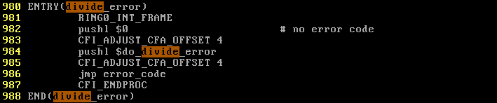
>
> - keyboard Interrupt<br>
>   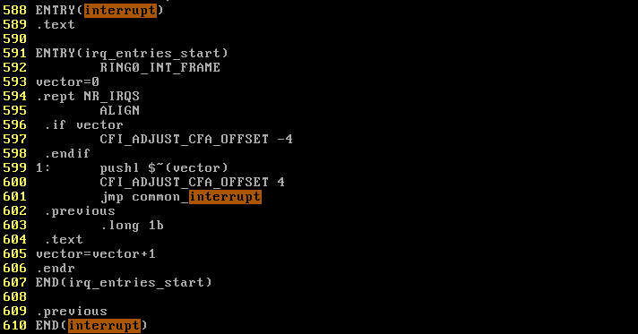
>
> - read System call<br>
>   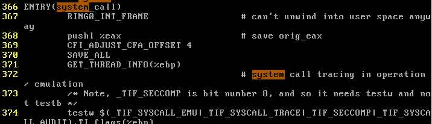