## HW7. sys_call_table[] is in arch/x86/kernel/syscall_table_32.S. How many system calls does Linux 2.6 support? What are the system call numbers for exit, fork, execve, wait4, read, write, and mkdir? Find system call numbers for sys_ni_syscall, which is defined at kernel/sys_ni.c. What is the role of sys_ni_syscall?

> 우선 Linux 2.6은 0번부터 326까지 총 327개의 system call을 지원한다.
> 
> 이는 `arch/x86/kernel/syscall_table_32.S`를 직접 확인해 보면 알 수 있다. 
>
> 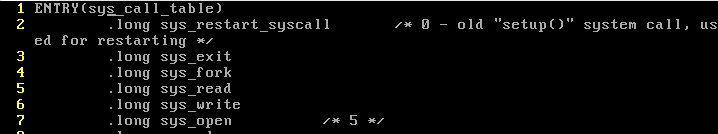<br>
> ...
> 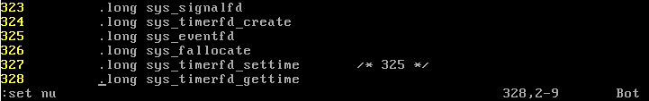<br>
>
> ---
> 위의 파일을 직접 확인해보면 다음의 정보 또한 확인할 수 있다. 
> 
> | function | system call | system call number |
> | -------- | ----------- | ------------------ |
> | exit     | sys_exit    | 1                  |
> | fork     | sys_fork    | 2                  |
> | execve   | sys_execve  | 11                 |
> | wait4    | sys_wait4   | 114                |
> | read     | sys_read    | 3                  |
> | write    | sys_write   | 4                  |
> | mkdir    | sys_mkdir   | 39                 |
>
> ---
> 이때, `sys_ni_syscall`이라는 system_call이 여러개 눈에 띄는데 해당 시스템 콜은 `kernel/sys_ni.c`에 정의되어 있다.
>
> 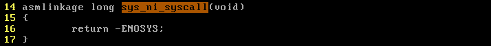
> 
> 확인해 보면 `-ENOSYS`를 바로 return 하고있는 것을 볼 수 있는데, 이것은 아직 구현되지 않은 함수를 사용할 때 반환되는 오류코드이다.

---
## HW8. Change the kernel such that it prints "length 17 string found" for each printf(s) when the length of s is 17. Run a program that contains a printf() statement to see the effect. 

> **Idea**
>
> `printf(s)`는 결국 `write(1, s, strlen(s))`을 호출하고, 또 이 `write()`는 컴파일시 `syscall(4)`를 호출한다.
>
> 즉, `printf`함수를 수정하기 위해서는 syscall_table의 4번 함수인 `sys_write()`함수를 고쳐주어야 한다.
>
> 이 `sys_write()`함수는 `fs/read_write.c`에 존재한다.
>
> ---
> **Code**
>
> 1. `fs/read_write.c/sys_write()`를 다음과 같이 고쳐준다.<br>
> 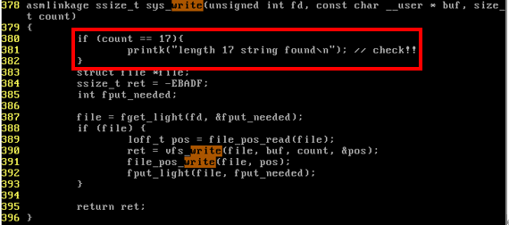
>
> 2. 수정한 내용이 반영되도록 Recompile and Reboot한다.
> 
> 3. 길이가 17인 문자열을 출력하는 코드를 만든다.<br>
> 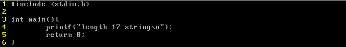
>
> ---
> **Result**
> 
> 결과를 확인하기 전 printk로 출력하는 내용을 볼 수 있도록 log level을 바꿔주어야 한다.
> 
> 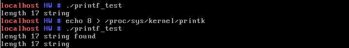
> 
> 그 후 코드를 확인해 본 결과 위와 같이 잘 동작하는 것을 알 수 있다.


---
## HW9 You can call a system call indirectly with "syscall()". Write a program that prints "hello" in the screen using syscall.
```cpp
write(1, "hi", 2); 
syscall(4, 1, "hi", 2); // 4 is the system call number for "write" system call
```
> **Code**
>
> 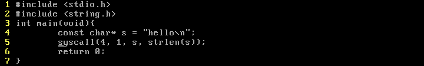
> 
> 먼저 위와 같이 C의 `syscall()`함수를 이용하여 hello를 출력하는 프로그램을 짜 주었다.
>
> 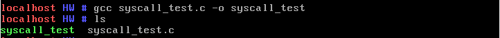
> 
> 그리고 gcc를 이용하여 syscall_test실행파일을 만들어 주었다.
>
> ---
> **Result**
>
> 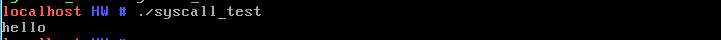
> 

---
## HW10. Create a new system call, my_sys_call with system call number 17 (system call number 17 is one that is not being used currently). Define my_sys_call() just before sys_write() in read_write.c Write a program that uses this system call. When the above program runs, the kernel should display "hello from my_sys_call". 


> **Define My Syscall Number**
>
> Custom Syscall을 정의하기 위해서는 다음과 같은 과정을 거쳐야 한다.
>
> 1. `arch/x86/kernel/syscall_table_32.S`의 Sys_call_table에서 알맞은 17번 Index에 내 syscall의 이름을 정의해 준다. <br>
> 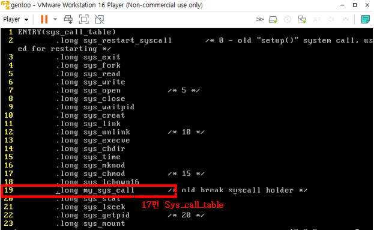
>
> 2. `fs/read_write.c`에 다음과 같이 `my_sys_call()`함수를 정의해 준다.<br>
> 
>
> 3. Recompile and Reboot
>
> *(참고)<br>
> `asmlinkage`는 어셈블리 코드에서 이 함수를 직접 호출할 수 있다는 의미이다.*
>
> ---
> **Result** 
> 
> `my_syscall_test`라는 c파일을 만들어 실행 결과를 확인해 보자.
>
> 
>
> 결과를 확인하기 전 printk로 출력하는 내용을 볼 수 있도록 log level을 바꿔주어야 한다.
>
>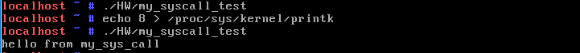
> 
> 17번 syscall을 잘 사용할 수 있는 것을 확인할 수 있다.

### HW10-1. Create another system call that will add two numbers given by the user.

> **Define My Syscall Number**
>
> 1. `arch/x86/kernel/syscall_table_32.S`의 Sys_call_table에서 알맞은 32번 Index에 내 syscall의 이름을 정의해 준다. <br>
> 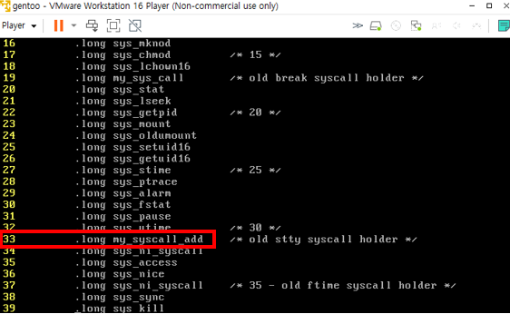
>
> 2. `fs/read_write.c`에 다음과 같이 `my_syscall_add()`함수를 정의해 준다.<br>
> 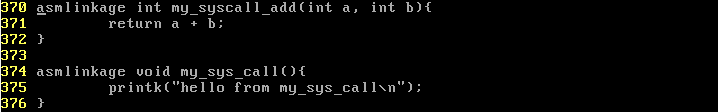
>
> 3. Recompile and Reboot<br>
> 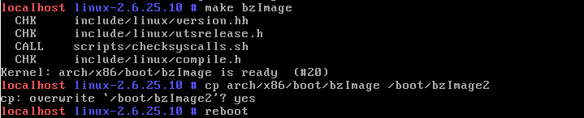
>
> ---
> **Result**
>
> `my_syscall_test`라는 c파일을 만들어 실행 결과를 확인해 보자.<br>
> 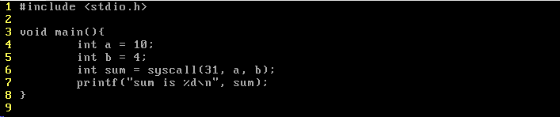
>
> 아래의 그림과 같이 31번 syscall이 잘 동작하고 있는것을 확인할 수 있다.<br>
> 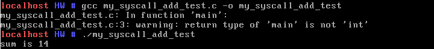

---
## HW11. Modify the kernel such that it displays the system call number for all system calls. Run a simple program that displays "hello" in the screen and find out what system calls have been called. Also explain for each system call why that system call has been used.

> **Idea**
>
> system call이 호출될 때, 우선 ISR1이 호출된 후 ISR2가 호출된다.
>
> ISR1은 `arch/x86/kernel/entry_32.S`에 존재한다.<br>
> 이때,  `system_call`의 경우, 해당 코드에서 `index`를 사용해 `syscall_table`에 저장된 ISR2를 호출한다.
> 
> 따라서, `system_call`을 호출할 때, 그 번호까지 같이 출력되도록 하기 위해서는<br>
> ISR1이 호출되는 `arch/x86/kernel/entry_32.S`에서 `systemcall`의 index를 출력하는 함수를 추가해주면 될 것이다.
>
> ---
> **Code**
>
> 1. `arch/x86/kernel/syscall_table_32.S`에 주어진 system call number를 출력하는 함수와 출력 여부를 결정하는 함수명 정의<br>
>   \<my_syscall_displayNum\><br>
>   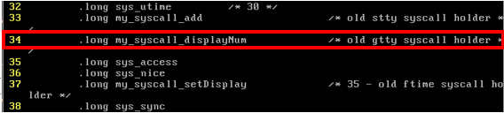<br>
>   \<my_syscall_setDisplay\><br>
>   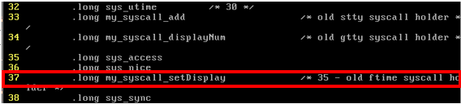
>
> 2. `fs/read_write.c`에 해당 함수들 구현<br>
>   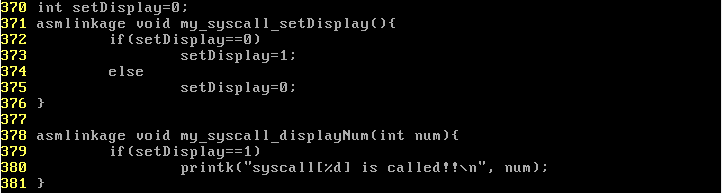
>
> 3. `arch/x86/kernel/entry_32.S` 수정 (in `Entry(system_call)` & `Entry(system_call)`)<br>
>   \<Entry(system_call)부분\><br>
>   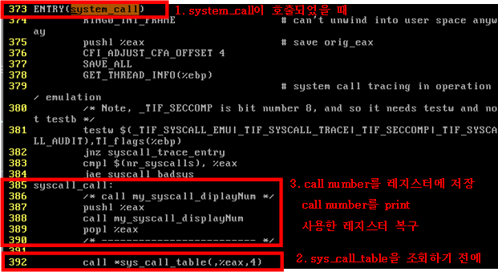<br>
>   \<Entry(ia32_sysenter_target)부분\><br>
>   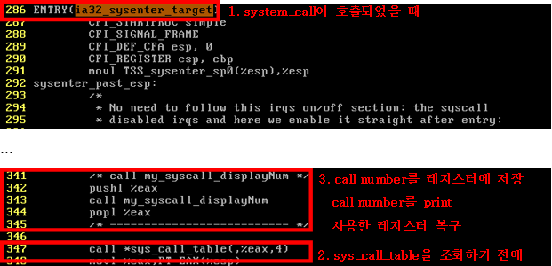
>
> 4. Recompile and Reboot
>
> ---
> **Result**
>
> 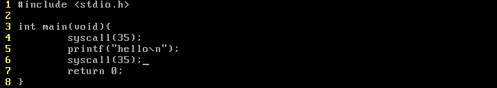
>
> 위와 같은 코드를 작성한 후<br>
> 마찬가지로 printk로 출력하는 내용을 볼 수 있도록 log level을 바꿔준다. <br>
> 마지막으로 해당 C프로그램을 실행해 본다.
>
> 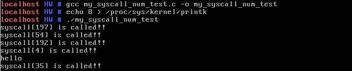
> 
> 그 결과 위와 같이 `hello`를 출력하기 까지 필요한 system call의 number를 모두 확인할 수 있다.
>
> ---
> **Explain**
>
> - **4(sys_write)** <br>
>   : 파일이나 소켓에 데이터를 쓰는 시스템 콜 <br>
>   <u>(user space에서 kernel space로 데이터를 전송하는 역할)</u>
> - **54(sys_ioctl)** <br>
>   : 입출력 장치 및 파일 디스크립터에 대한 제어 명령을 수행하는 시스템 콜 <br>
>    <u>(특정 장치의 속성을 설정하거나 정보를 얻을 때 사용)</u>
> - **192(sys_mmap2)**<br>
>   : 파일이나 장치를 메모리에 매핑하는 시스템 콜<br>
>   <u>(파일을 메모리에 로드하거나 특정 주소 공간을 파일과 연결하는 데 사용)</u>
> - **197(sys_fstat64)**<br>
>   : 파일의 메타정보를 가져올 때 사용<br>
>    <u>(파일 크기, 소유자, 권한 등과 같은 파일의 메타데이터를 반환)</u>
>
> *(35번 system call은 우리가 syscall number의 출력 여부를 결정하기 위해서 새롭게 정의해준 system call이었다.)*

---
## HW12. What system calls are being called when you remove a file? Use "system()" function to run a Linux command as below. Explain what each system call is doing. You need to make f1 file before you run it. Also explain for each system call why that system call has been used.

> HW11과 마찬가지로 파일을 만든 후 다음의 코드를 통해 지워 주었다.
> 
> 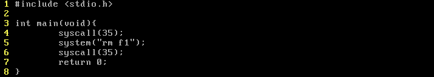
>
> ---
> **Result**
> 
> 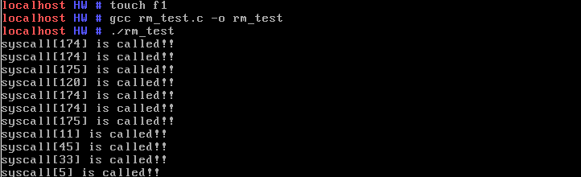
> <br> ... <br>
> 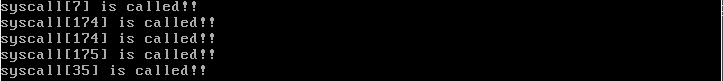
