## HW1. task_struct is defined in include/linux/sched.h (search for "task_struct {"). Which fields of the task_struct contain information for process id, parent process id, user id, process status, children processes, the memory location of the process, the files opened, the priority of the process, program name?

> linux에서는 Process Descriptor가 `task_struct`라는 구조체로 구현되어 있다.
>
> 즉 이를 활용해 Process정보에 접근할 수 있다.
> 
> ```cpp
> struct task_struct *task;
> ```
>
> ---
> **process id**
>
> 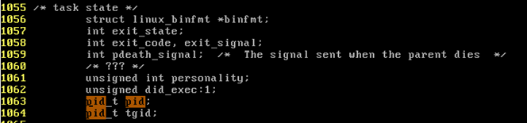
>
> ```cpp
> task->pid;
> ```
>
> ---
> **parent process id**
> 
> 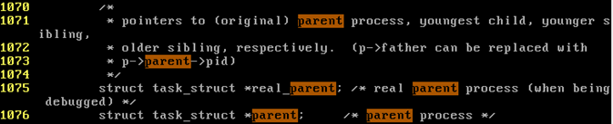
>
> ```cpp
> task->parent->pid;
> ```
>
> ---
> **user id,**
> 
> 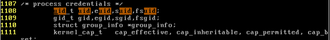
>
> ```cpp
> task->uid;
> ```
>
> ---
> **process status**
>
> 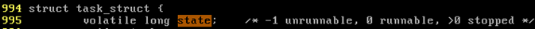
>
> ```cpp
> task->state;
> ```
>
> ---
> **children processes**
>
> 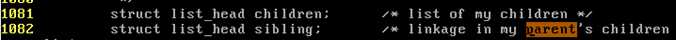
>
> ```cpp
> task->children;
> ```
>
> ---
> **the memory location of the process**
>
> 
>
> ```cpp
> task->mm;
> ```
>
> ---
> **the files opened**
>
> 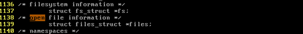
>
> ```cpp
> task->files;
> ```
>
> ---
> **the priority of the process**
>
> 
>
> ```cpp
> task->prio;
> ```
>
> ---
> **program name**
>
> 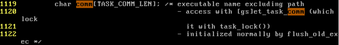
>
> ```cpp
> task->comm;
> ```

---
## HW2. Display all processes with "ps –ef". Find the pid of "ps -ef", the process you have just executed. Find the pid and program name of the parent process of it, then the parent of this parent, and so on, until you see the init_task whose process ID is 0.

> `ps -ef`명령 후 PPID를 따라가면 다음과 같다.
> 
> 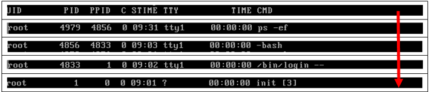

---
## HW3. Define display_processes() in init/main.c (right before the first function definition). Call this function in the beginning of start_kernel(). Confirm that there is only one process in the beginning. Find the location where the number of processes becomes 2. Use "dmesg" to see the result of display_processes().

> **Code 1**
> 
> 먼저 현재 열려있는 Process의 정보를 알기 위해서 `init/main.c`에 다음과 같은 함수를 작성한다.
> 
> 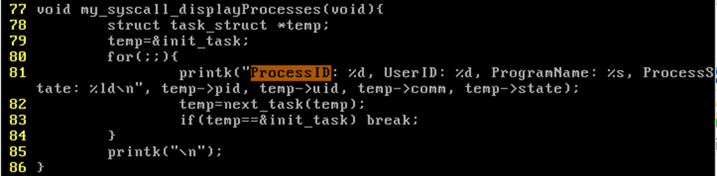
>
> 1. Kernel의 Process Descriptor인 `init_task`의 주소를 temp에 입력한다.<br>
>   (`init_task`는 `arch/x86/kernel/init_task.c`에 구현되어 있다.)
> 
> 2. Process Descriptor는 Process Queue라는 linked list로 연결되어 있는데, `next_task()`라는 함수를 통해 다음에 연결된 Process Descriptor를 불러올 수 있다.
> 
> 3. 이때, `next_task()`의 반환값이 `init_task`의 주소와 같을 때까지 이를 2번을 반복한다.
>
> ---
>
> 이제 위에서 작성한 `my_Syscall_displayProcess()`함수를 kelnel이 시작될 때 제일 처음 실행되는 `init/main.c/start_kernel()`함수의 첫 부분에 넣는다.
>
> 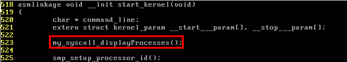
>
> ---
> **Result**
> 
> ```cmd
> dmesg > x
> vi x
> ```
> 를 통해 시스템의 부팅메시지를 확인해 보면 다음과 같이 kernel시작시 실행되어 있는 프로그램의 목록을 확인할 수 있다.
>
> 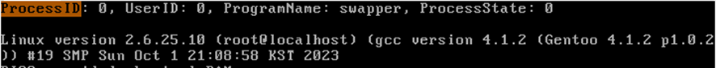
>
> 이를 보면 알수 있듯이 kernel의 시작부분에는 `ProcessID=0`인 단 하나의 Process만 실행되고 있음을 확인할 수 있다.

---
## HW4. Make a system call that, when called, displays all processes in the system. Run an application program that calls this system call and see if this program displays all processes in the system. 

> **Set Up**
> 
> System Call을 새로 정의 하는 방법은 다음과 같았다.
>
> 1. `arch/x86/kernel/syscall_table_32.S`에서 사용하지 않는 sys_call_table의 index, 즉 `sys_ni_syscall`를 찾는다.<br>
>   *(내 경우에 현재 44번 index가 사용하지 않고 있었다.)*
>
> 2. 해당 index에 새로운 system call의 이름을 쓴다.<br>
>   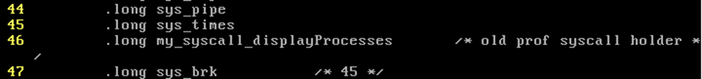
> 
> 3. 적절한 위치에 새로운 system call을 정의한다.<br>
>   : 현재 HW1에서 `init/main.c`에 이 system call을 정의해 놓았다.
> 
> 4. recompile and reboot
> 
> ---
> **Code**
>
> 그 후 44번 System Call을 호출하는 C프로그램을 작성해 주었다.
>
> 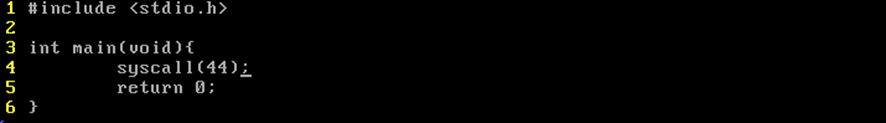
>
> --- 
> **Result**
> 
> 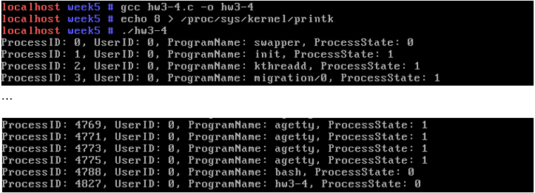
>
> 이 프로그램을 실행한 결과 위와 같이 출력되는 것을 확인할 수 있다.
> 
> 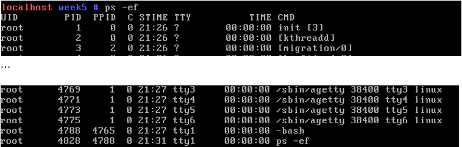
> 
> 이때, 이 내용은 `ps -ef`의 결과와 동일하다는 것 또한 확인하였다.

### HW4-1. Make a system call that, when called, displays all ancestor processes of the calling process in the system. For example, if ex1 calls this system call, you should see: ex1, ex1’parent, ex1’s parent’s parent, etc. until you reach pid=0 which is Linux itself.

---
## HW5. Run three user programs, f1, f2, and f3, and run another program that calls the the system call in Problem 3.4) as follows. State 0 means runnable and 1 means blocked. Observe the state changes in f1, f2, f3 and explain what these changes mean

> **Code**
> 
> 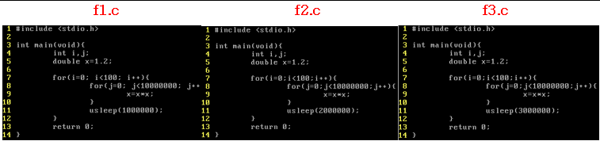
>
> 위와 같이 특정 연산을 수행한 후 각각 `1`초, `2`초, `3`초 동안 Sleep한 후 다시 특정 연산을 수행하도록 반복 하는 프로그램을 작성하였다.
> 
> 이때 `sleep`된 프로그램은 `sleep`이 끝나 CPU에 다시 Interrupt를 보내기 전까지 CPU의 `run Queue`에서 제외된다.
>
> 즉, 다음과 같은 코드를 활용하여 현재 실행되고 있는 Process State를 보면
>
> 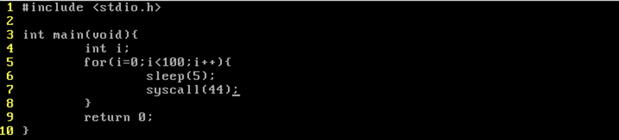
>
> State부분이 1로 바뀌게 된다.<br>
> *(`state==0`: runnable)<br>
> (`state==1`: blocked)<br>*
>
> ---
> **Result**
> 
> 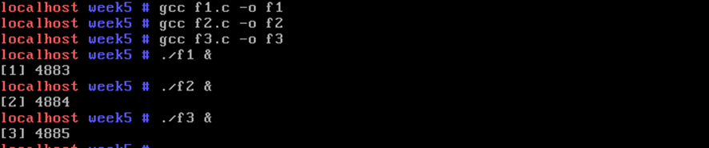
> 
> 위처럼 모든 코드를 실행한 결과 다음과 같이 Process State가 계속해서 바뀌는 것을 확인할 수 있었다.
>
> 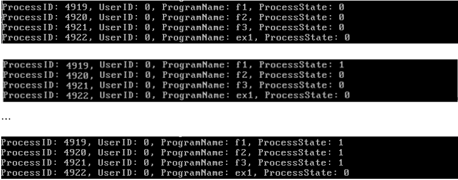
>
> 이때, sleep time이 1초밖에 되지 않는 `f1` Process는 대부분의 상황에서 Runnable(`ProcessState: 0`)한 것을 확인하였다.
>
> 또한 `f1`, `f2`, `f3`가 모두 sleep하고 있지 않는 상태에서 process state를 출력했을 때, 모든 Process가 `Run Queue`에 존재하는 상태도 존재하였고, 반면에 모두 sleep하고 있는 상태도 존재했던 것을 확인하였다.

---
## HW6. Modify your display_processes() so that it can also display the remaining time slice of each process (current->rt.time_slice) and repeat 3.5) as below to see the effect. "chrt -rr 30 ./f1" will run f1 with priority value = max_priority-30 (lower priority means higher priority). "-rr" is to set scheduling policy to SCHED_RR (whose max_priority is 99).

> ```cmd
> # chrt –rr 30 ./f1&
> # chrt -rr 30 ./f2&
> # chrt -rr 30 ./f3&
> # chrt -rr 30 ./ex1
> ```
> ---
> **Real-Time이란?**
> 
> Realtime은 실시간으로 프로세스를 수행한다는 뜻이다.
>
> 만약 Task A는 1초안에 수행하지 않으면 시스템에 치명적인 위해를 가할 수 있다고 하면 이 Task A의 time limit은 1초라고 할 수 있고 이 1초안에 프로세스를 수행하는 것을 Real Time이라고 한다.
> 
> 이때, 이 RealTime은 다시 Hard RealTime과 Soft RealTime으로 나뉘는데 전자는 정해진 시간안에 반드시 작업을 수행하도록 하는 것이고, 후자는 가능한한 정해진 시간안에 작업을 수행하도록 하는 것이다.<br>
> (즉, Soft RealTime의 경우 RealTime이 보장되지 않아도 된다.)
>
> Linux에서는 이 Realtime을 보장하기 위해서 다음과 같은 기능을 제공한다.
>
> ```cmd
> chrt -rr ${priority값} ${process번호} # schedule을 SCHED_RR로 설정
> chrt -f  ${priority값} ${process번호} # schedule을  SCHED_FIFO로 설정
> ```
> *(priority값이 낮을 수록 높은 우선순위를 가짐)*
> 
> *(참고)*
> - *`SCHED_RR`<br>
>   : 같은 Priority를 가지는 프로세스간 time-slice를 통해 Round-Robin방식을 취함*
> - *`SCHED_FIFO`<br>
>   : 스스로가 YIELD를 취하거나 더 높은 Priority를 가지는 프로세스에 의해 Interrupt될 때만 우선순위를 선점당함*
> - *`Remain Time Slice`<br>
>   : 프로세스는 Interrupt등의 이유로 정해진 시간동안 CPU를 다 못쓰고 중간에 다른 프로세스에 뺏기는 경우가 있는데, 이 때 다 못쓰고 남은 시간을 Remain Time Slice라고 함*
> 
> (자세한 내용: https://blog.naver.com/alice_k106/221149061940)
> 
> ---
> **Result**
>
> 각 프로세스의 Time Slice가 계속 줄어드는 것을 확인할 수 있다.
> 
> 
> 