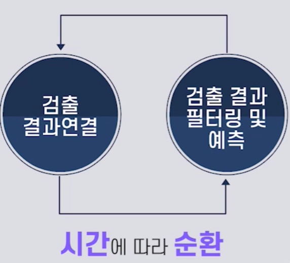
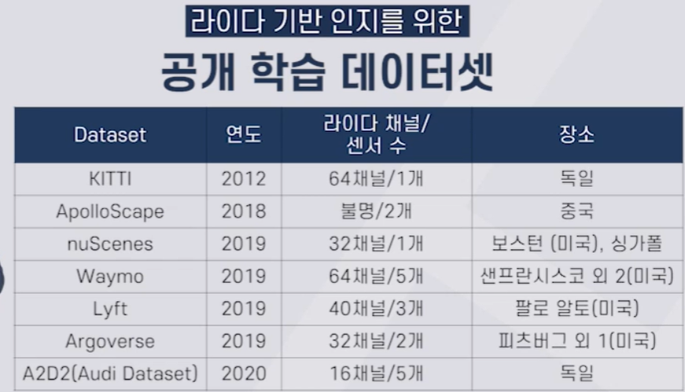

# 자율주행 통합 인지 시스템

## 구성

센서
- 카메라
- 레이더 
- 라이다

> 센서들의 동기화 필요

차량네트워크

자율주행 컴퓨터
- cpu, gpu, 하드웨어 가속기

소프트웨어
- 인지알고리즘

## 목표

> - 동적 객체 검출 및 추적 필요
> - 동적 객체의 미래 위치 예측 필요
> - 정적 객체 검출 필요
> - 정적 객체의 정보를 측위에 활용 필요
> - 물체의 거리를 알아내는 것 필요

## 기술

### 카메라
- 카메라 딥러닝 + 스테레오카메라
-> 경로예측, 거리추정, 분할 가능

### 레이더
- 조감도 영역에서의 동적 객체의 위치와 속도 측정 가능
- 동적 객체의 추적 가능
- 클러터 현상과 물체를 구분하는 것이 핵심

### 라이다
- 포인트 클라우드를 활용해 3차원 영역에서의 동적 객체의 위치를 검출 및 추적 가능

---
## 센서융합

---
# 인지를 위한 AI

## 모델
포인트넷

순서가 없는 점의 집합으로부터 유용한 특징값을 뽑아내기 위한 네트워크 구조
-> 라이다에서 사용

## 데이터관리

데이터에 따라 머신러닝, 딥러닝의 성능이 결정되므로 많은 데이터의 확보가 중요

일회성의 데이터로는 자율주행이 불가능

-> 데이터 취득, 라벨링, 학습, 검증, 적용(탑재)를 수행하는 시스템 플랫폼이 필요

데이터취득: 
- 전용차량을 통한 수집
- 자율주행차에서 수집된 데이터를 클라우드로 수집
- 인프라, 엣지등의 센서에서 데이터수집

데이터 검증 및 라벨링
- 능동학습: 불확실성이 큰 데이터만 라벨링하여 적은수의 데이터로 학습 성능을 극대화 시키는 전략

검증
- 시뮬레이션을 통한 테스트
- 섀도우모드: 자율주행차에 학습 모델을 탑재하여, 실제 작동되지는 않고 실제 상황에서는 어떻게 동작할지 테스트해보는 것

탑재
- 지속적인 관리 및 업데이트가 필요
- OTA기술

---

# 카메라 켈리브레이션

- 핀홀카메라 행렬모델
: 변환행렬을 사용해 월드좌표계의 3차원 점을 2차원영상의 픽셀좌표로 변환하는 것
    - 외부 파라미터(행렬)
        - 3차원 카메라 좌표계
            - 카메라의 현재 위치에 따라 결정됨
        - 3차원 월드 좌표계
            - 실제 세상을 나타내는 좌표계
        - 이 두 파라미터간의 변환을 나타내는 파라미터
            - 회전이동
            - 평행이동
    - 내부 파라미터(행렬)
        - 카메라 자체의 센업에 관련된 파라미터
        - 카메라 좌표계와 카메라 영상의 픽셀값과의 대응을 설명함
            - 초점거리
            - 렌즈왜곡
            - 영상 중심값
            - 이미지센서의 Aspect ratio, skew factor등
    - 렌즈의 왜곡도 고려할 필요 있음

> 이러한 변환 행렬을 찾는 것이 켈리브레이션

$w\begin{bmatrix} x & y & 1\end{bmatrix} = \begin{bmatrix} X & Y & Z & 1\end{bmatrix}P$

- $w$: 스케일 파라미터
- $x, y$: 카메라 영상의 한점(픽셀위치)
- $X, Y, Z$: 월드 좌표계의 한점의 좌표
- $P$: 카메라 행렬
    - $P = \begin{bmatrix} R \\ t \end{bmatrix}K$
    - 외부파라미터 행렬 
        - $R$: $3\times 3$의 회전행렬
        - $t$: $1\times 3$의 평행이동 벡터
    - 내부파라미터 행렬
        - $K = \begin{bmatrix} f_x & 0 & 0\\ s &f_y & 0\\ c_x & c_y & 1\end{bmatrix}$ 
        - $c_x, c_y$: 카메라 영상의 중심좌표
        - $f_x, f_y$: 픽셀단위로 표현된 카메라의 초점 길이
        - $s = f_x tan\alpha$: skew계수

렌즈왜곡 보정
    - 렌즈왜곡모델
        - 방사형 렌즈왜곡
        - 접선형 렌즈왜곡

---
---

# 딥러닝

카메라 기반 물체검출

## 카메라 기반 물체추적

각 프레임에서 얻은 검출결과를 같은 물체끼리 연결

예측 - 예측결과와 검출결과를 연결

### 예측
- 기존: 칼만필터
- 현재: RNN과 같은 딥러닝 모델

### 연결
- 적용: 유사성 측정
- 현재: 딥러닝으로 유사성 정도를 판단함

- Simamese network
    - 두개의 비슷한 네트워크를 사용해 특징값을 추출
    - 특징 사이의 유사도(거리) 출력
    - 유사도로(0~1) 변환

- 이를 모든 쌍에 대해 유사도를 적용하고
- 헝가리안 알고리즘을 사용해 연결함

--
## 레이더 기반 기술

### 특징

- 장점
    - 전자기파의 특성으로 주변의 환경 변화에 강인함
    - 속도 정보를 얻을 수 있음
    - 가격이 저렴함
- 단점
    - 횡방향의 해상도가 높지 않음
    - 클러터 현상으로 인해 오탐률이 높다.
    - 물체의 검출 결과를 조감도 영역에서만 표현됨

### 연구 방향
- 레이더 자체의 성능 개선
    - 해상도 개선
    - 클러터에 대한 강인성 개선
- 라이다 비용 절감
- 오탐률을 줄이기 위한 센서융합

### 고해상도 레이더
- MIMO안테나: 많은수의 배열안테나로 구현하여 해상도 증가
- 4D이미지 레이더 : 4차원정보(x,y,z,속도)를 알아내어 point cloud형태로 제공하는 기술

### 딥러닝 기술
- 기존에는 레이더를 신호처리 기술을 사용해 개선후 사용함
- 이때, 제조업체마다 고유의 솔루션이 있어 외부에서는 어떤 알고리즘을 사용하는지 파악할 수 없음

- 카메라와 딥러닝을 사용해 센서 융합을하여 서로의 단점을 보완하고자 함

1. 해상도가 높지 않은 경우
    - 수신신호에 대해 슬라이딩 윈도우를 통해 2차원 거리-도플러 영상을 얻을 수 있음
    - 이 영상을 딥러닝을 적용해 조감도 영역에서의 2차원 물체 검출을 할 수 있음

2. 고해상도 레이더의 경우
    - MIMO를 통해 얻은 포인트 클라우드 데이터는 3차원 데이터임
    - 라이다에서 사용되는 3차원 물체 검출 방법을 적용
        - 레이더 포인트 클라우드의 전처리 방법에 따라 다음 3가지로 구분:
            - 복셀(3차원 블록) 기반의 방법: 복셀별로 3차원 CNN을 적용해 검출
            - 포인트 데이터를 조감도영역으로 투영하여 2차원 CNN을 적용해 검출
            - 포인트넷이라고 하는 포인트 클라우드를 직접 처리하는 방법

- 레이더 데이터 셋
    - nuScenes이라는 데이터셋
        - Continental ARS레이더임
    - ASTYX HirRES2019 데이터셋

### 센서융합
    - 카메라 위주의 검출 -> 레이더 정보 추가
    - 카메라 영상+레이더 영상 -> 딥러닝을 통한 Featuremap 추출 -> 결합 -> 딥러닝을 다시 적용해 물체 검출

---
## 라이다 기반 기술

기존: 905nm의 파장을 사용 
- 이는 습도에 영향을 많이 받음
최근: 1550nm의 파장을 개발하고 있음

### 기계식라이다
- 현제 가장 많이 사용하는 라이다
- 기계식 회전을 통해 레이저 발사

장점
- 넓은 범위의 스캐닝

단점
- 진동에 의한 내구성문제

### 솔리드스테이트 라이다
- Optical Phased Array라는 배열안테나를 사용해 기계적인 회전이 아닌 안테나 원소의 위상을 조절해 원하는 방향으로 레이저를 발사하고 수신하는 안테나

장점
- 진동등에 영향을 받지 않음

단점
- 장거리 탐지시 고출력이 필요해서 실제 자율주행에 사용하기에는 어려움

### MEMS라이다
- 레이저 소스를 MEMS기술로 반사거울을 제어해 넓은 영역 스캐닝

- 장점
    - 장거리 탐지 가능

- 단점
    - 진동 및 저온에 취약

