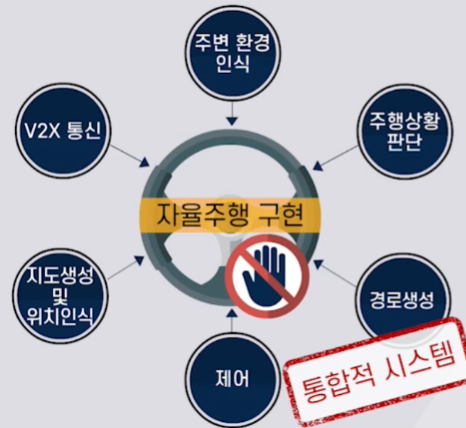

자율주행의 구성기술

인지-판단-제어

인지: 자율주행센서로 차량주변을 파악

판단: 인지결과를 바탕으로 경로생성

제어: 경로추종

---

## 2. 판단시 고려요소

인지에서의 입력들에 대해 정보의 중요도(우선순위)를 설정해야 함

### 1) 센서의 특징

> | | 카메라 | 라이다 | 레이더 |
> | --- | --- | --- | --- |
> | 장점 | ⅰ. 정보의 양이 많음  ⅱ. 원거리 물체를 인식할 수 있음 | ⅰ. 거리정보에 강함  ⅱ. 날씨 변화에 강함 | ⅰ. 속도탐지에 유리함  ⅱ. 원거리 물체를 인식할 수 있음 |
> | 단점 | ⅰ. 거리정보에 약함  ⅱ. 날씨 변화에 약함 | ⅰ. 정보의 양이 적음  ⅱ. 센싱거리에 한계가 있음 | ⅰ. 해상도가 낮음  ⅱ. 횡방향 정확도가 낮음  ⅲ. 비금속 물체 탐지에 취약함 |
>
> ---
> #### 센서정보 활용 방법
> 
> | | 센서퓨전관점 | 멀티센서관점 | 
> | --- | --- | --- |
> | 정의 | 카메라, 라이다, 레이더의 통합인식정보를 전달받아 판단하는 것 | 카메라, 라이다, 레이더의 개별 인식정보를 전달받아 판단 |
> | 특징 | 판단부분에서 고려할 요소들이 적지만 인식정보가 매우 정확해야 한다 | 센서별 신뢰도 우선순위를 상황별로 다르게 할 수 있음(ex. 현재 날씨) |

### 2) 도로 인프라

> 도로 인프라에서 정보를 얻어 판단할 수 있다.
>
> 이 도로인프라 정보는 정보의 중복제공이라는 불필요한 것이 아니라, 안전성 향상을 위해 반드시 필요한 정보이다.
>
> | V2I | V2X |
> | --- | --- |
> | 좁은의미의 도로 인프라 | 넓은 의미의 도로 인프라 |
> | V2I | V2I V2V V2P V2N V2C |

---
## 3. 판단 방법론

### 1) Rule Based 방법

> 조건에 따라 어떤 행동을 할지 Rule을 각각 정해주는 것
> 
> | | 간단한 경우 | 복잡한 경우 |
> | 특징 | 인식 정보(센서+인프라)의 개수가 적음 | 인식 정보(센서+인프라)의 개수가 많음 |
> | 주의점 | 상황별로 신뢰할 센서, 인프라의 정보를 결정해야 함 ⅱ. 서로 다른 센서/인프라가 같은 대상의 인식정보를 제공할 때 신뢰도 분배에 대한 결정이 필요함 |
> | 예시 | 고속도로 환경에서 하나의 차선만 사용하는 경우 | 교차로 상황 |

### 2) AI Based 방법

| | Rule Based | AI Based |
| 장점 | 정확한 성능 예측 가능 | 융통성 $\uparrow$ _(다양한 주행환경 가능)_ |
| 단점 | 융통성 $\downarrow$ _(다양한 주행환경 불가)_ | ⅰ. 특정 기준에 대한 잣대가 없음 ⅱ. 고장판단 및 오류수정이 어려움 |

이에 두가지 방법을 융합하는 방식도 연구되는 중

---
## 4. 상황별 판단

### 크루즈
SCC, ACC, ASCC -> ADAS 
LKA: 차선유지 보조기능 :차간거리 유지 기능

- 주변환경 정보 및 자차 상태 정보 필요

- 원리(Rule based Approach)
    - 카메라센서: 차로정보 인식(중앙으로 달리는지)
    - 레이더센서: 선행차량 정보 인식(속도)

    - 선행차량이 없으면 설정된 속도로 주행
    - 선행차량이 있으면 설정된 차간거리를 유지하여 주행
    - 선행차량이 없어지면 설정된 속도까지 가속

### 차로변경/추월 판단

360도 센싱이 중요

- 원리
    - 카메라센서
    - 라이다센서: 후방/전방 차량의 거리및 속도측정
    - 레이더센서: 후방/전방 차량의 거리및 속도측정
    - 진입가능 여부/ 진입시 필요속도 계산

추월 원리
    - 차로변경 N회 시행

### 교차로/좌우회전 판단

- 원리
    - 카메라, 라이다, 레이더
    - 카메라 기반 신호등 인식(도로신호등 + 보행자신호등)

---
판단: 경로생성 + 주행상황 판단
## 경로생성기술
경로계획기술: 출발지점부터 목적 지점까지 경로를 생성하는 과정
- 전역 경로계획
    - 풀린 기술임 -> 지역경로계획이 중요
- 지역경로계획
    - 안전성과 효율성을 동시에 생각해야함

주변환경 인식기술 자차위치 인식기술 필요

## 대표알고리즘
