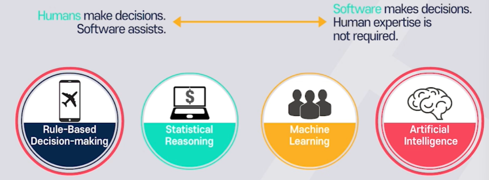

| 상황 | 사용센서 | 특징 |
| --- | --- | --- |
| 교차로 상황 | 카메라 라이다 레이더 | ⅰ. 센싱해야할 정보가 많음 $\rightarrow$ 상대 차량의 의도 파악 필요  $\rightarrow$ 동적 객체들에 대한 충돌예측 필요  ⅱ. 중간영역에는 차로가 없음 $\rightarrow$ 주변 차량과의 상호 협력적 정보교환 필요  $\rightarrow$ 가상의 경로 생성 | 
| 돌발 상황 _(임시공사, 사고)_ | 카메라 라이다 레이더 | 돌발상황회피 및 연속주행을 목표로 대처해야 함  ⅰ. Rule based판단  $\rightarrow$ 모든 경우에 대해 대응하는데 한계 존재 ⅱ. AI Based $\rightarrow$ Classification이나 Understanding으로 상황 판단 $\rightarrow$ 주행가능공간 판단 필요 |
| 날씨 _(눈비, 안개)_ | 차량의 레인 센서 $\rightarrow$ 눈비의 양 파악  타이어 슬립 추정 $\rightarrow$ 타이어의 미끄러지는 정도를 통해 노면상태 파악  딥러닝  $\rightarrow$ 장면분류를 통한 날씨 추정 | 각각의 날씨와 도로 표면상태에 따른 주행 기준을 마련할 수 있음 |

---
추가 판단 종류

| | 중요성 | 구성 | 종류 |
| V2X정보 기반 판단 | 안전성을 위한 정보의 중복성 관점에서 반드시 필요 | **센서기반 인식 VS V2X기반 인식** ⅰ. 센서기반인식: 정확성 부족  ⅱ. 통신기반인식: 해킹 및 인프라의 항상성 문제 | |
| Fail Safe 판단 | 어떤 부분에 기능적인 Fail이 발생하면  자체적인 안정장치가 동작해야 함 | **Fail Safe 단계별 특징**  ⅰ. Fail Passive 곧바로 운행 중지  ⅱ. Fail Active 경보를 울리고 짧은시간동안만 운전 가능  ⅲ. Fail Operational 보수가 될때 까지 기능을 유지하는 것 | ⅰ. 고장 부품을 대비해 여러개 사용  ⅱ. 소프트웨어적 대응: 다른센서가 고장 부품을 대체 |

---
#### Rule Based Decision making

주어진 입력에 대해 미리 정의된 규칙에 의해 의사결정 하는 방법

- 주행상황(차로변경, 추월, 정차, 가감속)에 대한 판단

Statistical Reasoning
Machine Learning

각 단계별 장단점이 명확해 두 방식을 융합하는 것이 필요, 나중에도 같이 쓰게될 것

---
- 차로유지판단: 센서로 양쪽 차선을 찾고 양 차선의 중앙 경로 생성 및 현재 상태 파악

- 차로 변경판단: 양쪽 차선 인식/ 차선들의 중앙값을 생성해 경로 후보들 생성/ 차량 주변의 정보 추정/ 거리 및 속도 확보 후 차선 변경

- 교차로 상황 판단: 신호등 인식/ 충돌회피(직진, 우회, 정차) 규칙/ 이때, 모든 정보에 우선순위를 설정해야함

---

#### AI BASED

카메라 정보/ 판단결과/ 제어신호를 넣어 모델을 학습

새로운 상황에 대해 적합한 판단을 예측

판단: 주행경로 생성 차선유지/차선변경등 판단

- 차로유지판단: 차량 센서로부터 정보(차선위치, 조향각, 자차위치, 가감속정보)를 학습

- 차선 변경: 차량 센서로부터 정보(차선위치, 자차위치, 주변 차량위치및 속도, 목표 차선의 후방전방 차량 위치/ 차선변경 가능지역)을 학습

- 교차로 상황 판단: 정보의 우선순위는 학습으로는 판단하기 힘들다. -> 다양한 상황에서의 데이터 필요 -> Rule based와의 융합할 수 있음

---
### 경로생성 알고리즘

#### A*알고리즘

현실세계를 2D Grid로 생성 - 격자단위의 크기가 경로생성의 성능을 결정함

8방향에 대해 cost를 고려해 경로 생성

F = G(시작점부터 현재까지 비용) + H(현재까지 목적지까지 예상비용)

#### RRT 알고리즘

근접한 포인트들을 랜덤으로 생성해 경로 생성

여러 경로중 최적의 경로 선택

즉, 경로생성의 최적성이 보장되지는 않음

- 시작지점과 목적지점을 어떻게 설정하는지가 중요함
- 실시간으로 반복적인 수행이 필요함

---
#### 강화학습

차선유지 시나리오

실제 운전을 하며 다양한 환경에 대해 강화학습 모델을 반복학습

주행센서의 입력 데이터와 그에 따른 판단결과가 다양할수록 강화학습 모델의 성능이 향상됨